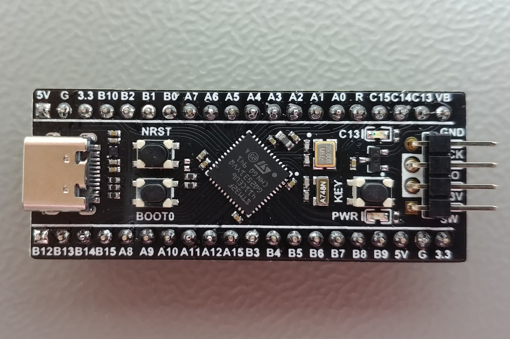
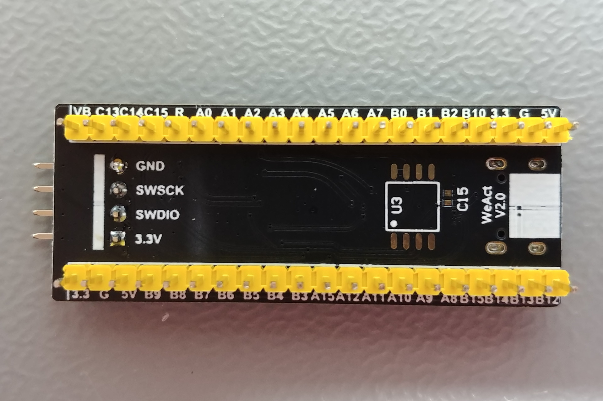
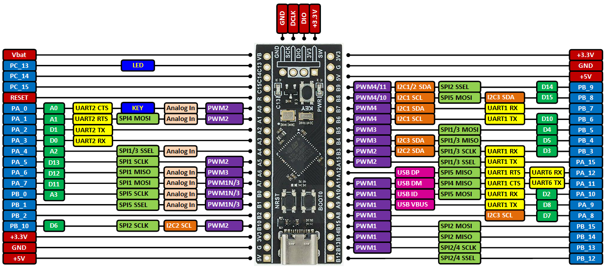

# STM32F411CEU6 “Black Pill” – Development Board

## Overview

The STM32F411CEU6, commonly known as the **Black Pill**, is a compact and powerful development board used in this course.

It is based on the STM32F4 series microcontroller from STMicroelectronics and provides:

- High-performance ARM Cortex-M4 core
- Rich set of peripherals
- Precise timers and ADC
- Hardware communication interfaces

In this course it is used to practice:
- Embedded C development (bare-metal and STM32 HAL/LL)
- Register-level programming
- Peripheral drivers
- Real-time concepts (interrupts, timers)
- Communication protocols

---

## Image

---

## Key Specifications

- MCU: STM32F411CEU6 (ARM Cortex-M4 @ 100 MHz)
- Flash: **512 KB**
- SRAM: **128 KB**
- Logic level: **3.3V**
- FPU: Yes (hardware floating point)
- Package: LQFP48

⚠ All GPIO operate at **3.3V logic**.

---

## Important Electrical Limits

- Maximum GPIO voltage: **3.3V** (some pins are 5V tolerant, but do not rely on it)
- Recommended current per GPIO: ~20 mA
- Total current across all GPIO must be limited
- Never power motors directly from GPIO

Always use common ground between modules.

---

## Commonly Used Peripherals in Course

| Peripheral | Notes |
|------------|-------|
| GPIO | Digital input/output |
| ADC | Analog sensor reading |
| PWM (TIM) | Servo / motor control |
| I2C | Sensors, OLED |
| SPI | Displays, sensors |
| UART | Debugging / communication |
| Timers | Precise timing |
| Interrupts | Encoder, button |

---

## Pinout

---

## Important Pins

⚠ Pin mapping depends on firmware configuration.

Typical usage:

- I2C:
    - PB6 → SCL
    - PB7 → SDA

- UART:
    - PA9 → TX
    - PA10 → RX

- SPI:
    - PA5 → SCK
    - PA6 → MISO
    - PA7 → MOSI

- ADC:
    - PA0–PA7, PB0, PB1

- PWM:
    - Available on most timer-capable pins (TIM1–TIM4)

Avoid using:
- SWD pins without understanding consequences
- Incorrect alternate function mappings

---

## Debug Interface (SWD)

The board supports debugging via **SWD (Serial Wire Debug)**:

- PA13 → SWDIO
- PA14 → SWCLK

Used with:
- ST-Link V2 / V3

Required for:
- Flashing firmware
- Debugging

---

## Power Options

- 5V pin
- 3.3V pin (regulated)

---

## Boot Modes

Boot mode is selected using **BOOT0 pin**:

- BOOT0 = 0 → Boot from Flash
- BOOT0 = 1 → System bootloader (UART)

Used for:
- Initial flashing
- Recovery

---

## Common Student Mistakes

- Applying 5V to GPIO
- Forgetting common ground
- Not enabling peripheral clocks
- Misconfiguring alternate functions (AF)
- Using wrong UART pins
- Disabling SWD pins accidentally

---

## Typical Use in This Course

- UART communication with ESP32
- PWM using timers (servo control)
- ADC reading (potentiometer, sensors)
- Interrupt handling (button, encoder)
- Register-level programming
- Basic DMA usage (optional)

---

## Documentation

Official documentation:

- https://www.st.com/resource/en/reference_manual/dm00119316.pdf
- https://www.st.com/resource/en/datasheet/stm32f411ce.pdf

STM32 HAL/LL:

- https://www.st.com/en/embedded-software/stm32cubef4.html

Useful links:

- brief information: https://stm32-base.org/boards/STM32F411CEU6-WeAct-Black-Pill-V2.0
- board schematics: https://stm32-base.org/assets/pdf/boards/original-schematic-STM32F411CEU6_WeAct_Black_Pill_V2.0.pdf

---

## Summary

The STM32F411CEU6 Black Pill is a powerful 3.3V microcontroller board suitable for:

- Low-level embedded development
- Real-time systems
- Peripheral-level programming
- Learning MCU architecture
