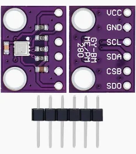
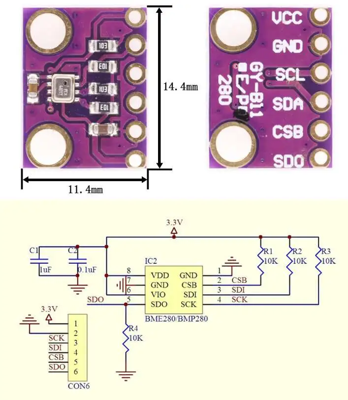
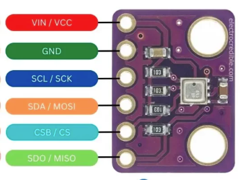

# BME280 - Temperature, Humidity, Pressure Sensor

## Overview

The **BME280** is a digital environmental sensor that measures:

- Temperature
- Humidity
- Atmospheric pressure

In this course it is used to practice:

- I2C communication
- SPI communication
- Sensor configuration
- Reading calibrated digital sensor data
- Displaying measurements on display

---

## Image

---

## Key Specifications

- Supply voltage of sensor core: **1.7V - 3.6V**
- Logic level: **3.3V**
- Interface: **I2C or SPI**
- I2C address: **0x76 or 0x77**
- Measurements:
    - Temperature
    - Relative humidity
    - Atmospheric pressure
- Low power consumption

⚠ The bare BME280 sensor is not 5V tolerant. Some breakout boards include regulators or level shifting, but you must verify the module.

---

## How It Works

The BME280 contains sensing elements and an internal ADC.

The sensor:

- Measures raw temperature, humidity, and pressure values
- Stores calibration constants internally
- Sends digital data to the MCU
- Requires compensation formulas, usually handled by a driver library

For most course projects, use an existing BME280 library instead of manually implementing the compensation formulas.

---

## Basic Circuit / Connection

Typical I2C wiring:

| BME280 Pin | ESP32-S3 / STM32F411 Connection | Notes |
|------------|----------------------------------|-------|
| VCC | 3.3V | Use 3.3V unless module clearly supports 5V |
| GND | GND | Common ground required |
| SDA | I2C SDA | Data line |
| SCL | I2C SCL | Clock line |
| CS | 3.3V | Selects I2C mode on many modules |
| SDO | GND or 3.3V | Selects I2C address |

Address selection:

- SDO -> GND: usually **0x76**
- SDO -> 3.3V: usually **0x77**

---

## Important Electrical Notes

- Use 3.3V logic with ESP32-S3 and STM32F411.
- Do not connect sensor pins directly to 5V logic.
- I2C requires pull-up resistors on SDA and SCL.
- Many breakout boards already include pull-ups.
- Typical I2C pull-up values are **2.2k ohm - 10k ohm**.
- Long wires can make I2C unreliable.
- Always use common ground.

---

## Basic Calculations

### I2C Pull-up Current

When an I2C line is pulled LOW, current flows through the pull-up resistor.

\[
I = \frac{V}{R}
\]

Example with 3.3V and 4.7k ohm:

\[
I = \frac{3.3}{4700} \approx 0.7mA
\]

This is safe for typical MCU and sensor I2C pins.

### Pressure to Altitude (Approximate)

Pressure can be used to estimate altitude, but it depends on weather.

\[
altitude \approx 44330 \cdot \left(1 - \left(\frac{P}{P_0}\right)^{0.1903}\right)
\]

For beginner projects, treat this as an approximation, not a precise height measurement.

---

## Typical Use in This Course

- Read temperature, humidity, and pressure over I2C
- Scan the I2C bus to find the address
- Display measurements on SSD1306 OLED
- Send sensor data over UART
- Log environmental values

---

## Common Student Mistakes

- Using the wrong I2C address
- Swapping SDA and SCL
- Forgetting I2C pull-ups
- Powering a 3.3V-only module from 5V
- Not checking whether the module is BME280 or BMP280
- Expecting humidity data from a BMP280

---

## Advantages

- Measures three environmental values
- Digital output is less noisy than raw analog sensors
- Low power consumption
- Widely supported by libraries
- Works well with 3.3V microcontrollers

---

## Limitations

- Requires I2C or SPI driver code
- Not 5V tolerant as a bare sensor
- Humidity and pressure readings need calibration and settling time
- Altitude estimate depends on local pressure changes

---

## Datasheet

Bosch official product page:

[https://www.bosch-sensortec.com/products/environmental-sensors/humidity-sensors-bme280/](https://www.bosch-sensortec.com/products/environmental-sensors/humidity-sensors-bme280/)

Bosch BME280 datasheet:

[https://www.mouser.es/datasheet/3/1046/1/bst_bme280_ds002.pdf](https://www.mouser.es/datasheet/3/1046/1/bst_bme280_ds002.pdf)

---

## Summary

The BME280 is a useful digital sensor:

- Measures temperature, humidity, and pressure
- Uses I2C or SPI
- Usually runs at 3.3V logic
- Requires the correct address and pull-ups
- Is ideal for practicing sensor communication and data display
