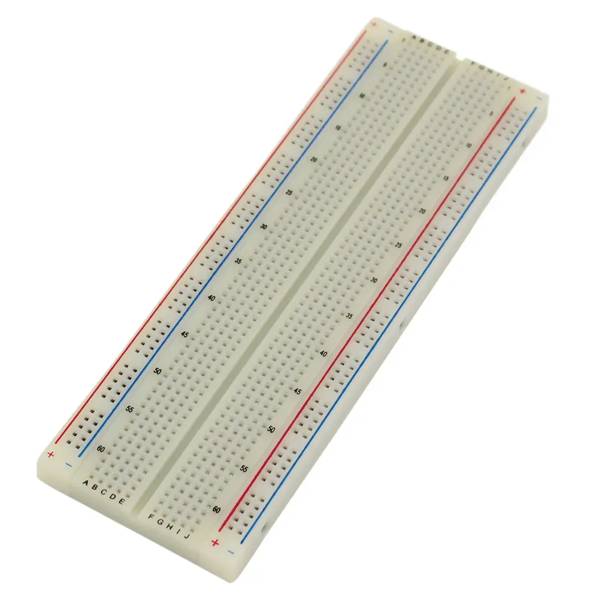
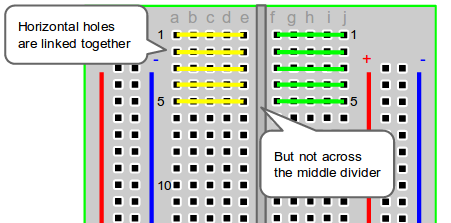

# Breadboard - Solderless Prototyping Tool

## Overview

A **breadboard** is a solderless prototyping board used to build and test circuits quickly.

It allows students to connect components, modules, and jumper wires without soldering.

In this course it is used to:

- Build temporary circuits
- Test GPIO, ADC, PWM, I2C, SPI, and UART examples
- Connect sensors and modules
- Debug wiring before soldering

---

## Image

---

## Key Specifications

- Type: solderless breadboard
- Connection style: spring contacts
- Typical pitch: **2.54mm**
- Common areas:
    - Terminal strips
    - Power rails
    - Center gap for DIP packages
- Intended use: low-voltage prototyping
- Typical course logic level: **3.3V**

---

## What It Is Used For

The breadboard is used to connect circuits temporarily.

Typical tasks:

- Connecting LEDs with resistors
- Testing buttons and pull-up resistors
- Wiring I2C sensors
- Connecting potentiometers to ADC pins
- Prototyping transistor driver circuits

---

## How to Use

1. Place the MCU board on the breadboard.
2. Connect GND from the MCU to the breadboard ground rail.
3. Connect 3.3V or 5V only to the rail that needs it.
4. Insert components into separate rows.
5. Use jumper wires to connect rows.
6. Check the circuit visually before powering it.
7. Measure power rails with a multimeter before connecting sensitive modules.

⚠ On most breadboards, each group of five holes in a row is internally connected.

⚠ Power rails may be split in the middle. Check continuity if the rail does not behave as expected.

---

## Important Notes / Safety

- Do not use breadboards for mains voltage.
- Do not use breadboards for high-current loads.
- Avoid forcing thick leads into contacts.
- Disconnect power before changing wiring.
- Keep 3.3V and 5V rails clearly separated.
- Check for loose jumper wires.
- Use common ground between boards and modules.

---

## Typical Use in This Course

- First LED and button circuits
- ADC circuits with potentiometers and sensors
- I2C modules such as BME280 and SSD1306
- Pull-up and pull-down resistor practice
- Motor driver control-side wiring

---

## Common Student Mistakes

- Misunderstanding which holes are connected
- Forgetting the center gap
- Powering the wrong rail
- Mixing 3.3V and 5V rails
- Not connecting common ground
- Using loose or damaged jumper wires
- Building circuits that draw too much current for breadboard contacts

---

## Advantages

- No soldering required
- Fast to change circuits
- Good for learning and debugging
- Reusable
- Works well with 2.54mm components and modules

---

## Limitations

- Connections can be loose
- Not suitable for high current
- Not suitable for high frequency or precision analog circuits
- Layout can become messy
- Some modules do not fit well

---

## Summary

The breadboard is the main prototyping tool for the lab:

- Use it for temporary low-voltage circuits
- Keep power rails clear and measured
- Disconnect power before rewiring
- Avoid high-current or mains circuits
- Move reliable designs to soldered wiring or PCB later
