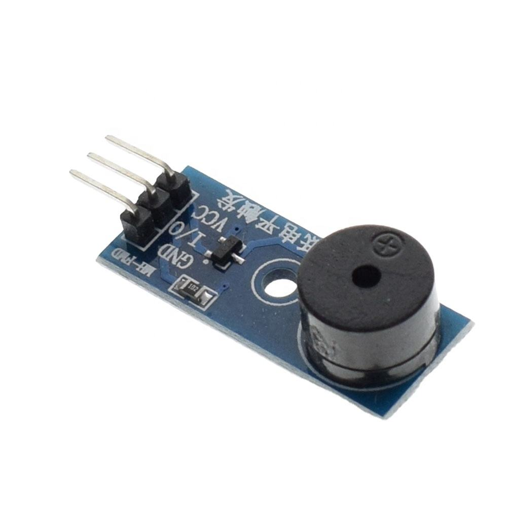
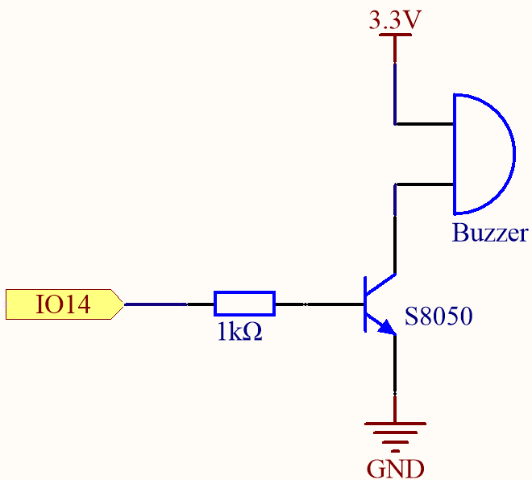

# Passive Buzzer - Sound Output Component

## Overview

A **passive buzzer** is a small sound component that produces a tone when driven with a changing signal.

Unlike an active buzzer, it does not generate sound from DC voltage alone. It needs a square wave or PWM signal.

In this course it is used to:

- Practice PWM output
- Generate simple tones
- Create audio feedback
- Learn the difference between active and passive buzzers

---

## Image

---

## Key Specifications

- Type: Passive piezo buzzer
- Drive signal: square wave or PWM
- Typical voltage: **3.3V - 5V** depending on model
- Typical current: low for piezo buzzers, higher for magnetic buzzers
- Polarity: some buzzers are polarized, some are not
- Sound frequency: set by PWM frequency

⚠ Check whether your part is passive or active. They are used differently in firmware.

---

## How It Works

A passive buzzer vibrates when the voltage across it changes.

To create sound:

- The MCU outputs a square wave
- The buzzer vibrates at that frequency
- The frequency determines the pitch

Example:

- 440Hz -> musical note A4
- 1000Hz -> common beep tone
- 2000Hz -> higher-pitched beep

---

## Basic Circuit / Connection

For a small piezo buzzer:

| Buzzer Pin | Connection |
|------------|------------|
| + | GPIO PWM output |
| - | GND |

For a buzzer that needs more current:

- GPIO -> transistor base/gate through driver circuit
- Buzzer -> external supply through transistor or MOSFET
- Common ground between MCU and supply

---

## Important Electrical Notes

- Do not exceed the GPIO current limit.
- Use a transistor driver if the buzzer current is too high.
- Some buzzers have polarity marks. Connect **+** to the signal or supply side.
- Passive buzzers need PWM or a timer output.
- Active buzzers only need ON/OFF voltage and produce a fixed tone.
- Magnetic buzzers may create small voltage spikes; a driver circuit is safer for larger parts.

---

## Basic Calculations

### Frequency and Period

\[
T = \frac{1}{f}
\]

For a 1kHz tone:

\[
T = \frac{1}{1000} = 1ms
\]

A 50% duty square wave would be:

- HIGH for 0.5ms
- LOW for 0.5ms

### Current Check

If a buzzer draws 20mA from 3.3V:

\[
P = V \cdot I = 3.3 \cdot 0.02 = 0.066W
\]

20mA may be too high for some MCU GPIO pins, so a transistor driver is recommended.

---

## PWM Usage

For a passive buzzer:

- PWM frequency controls pitch
- Duty cycle usually stays near 50%
- Turning PWM off silences the buzzer

Changing duty cycle mostly changes waveform shape and loudness, not the musical note.

---

## Typical Use in This Course

- Startup beep
- Button feedback sound
- Simple alarm tone
- PWM and timer practice
- Encoder-controlled tone frequency

---

## Common Student Mistakes

- Using DC output with a passive buzzer and hearing nothing
- Confusing active and passive buzzers
- Driving a high-current buzzer directly from GPIO
- Forgetting polarity on polarized buzzers
- Using a PWM frequency outside the audible range
- Leaving the buzzer permanently enabled in a loop

---

## Advantages

- Simple sound output
- Good for learning PWM frequency control
- Cheap and common
- Useful for feedback without a display

---

## Limitations

- Sound quality is basic
- Can be annoying during debugging
- Loudness depends on drive circuit and buzzer type
- Some buzzers need a transistor driver
- Passive buzzers require timer/PWM configuration

---

## Summary

The passive buzzer is a simple sound output:

- Needs PWM or a square wave
- Frequency controls pitch
- May require a transistor driver
- Is useful for alarms, feedback, and timer practice
