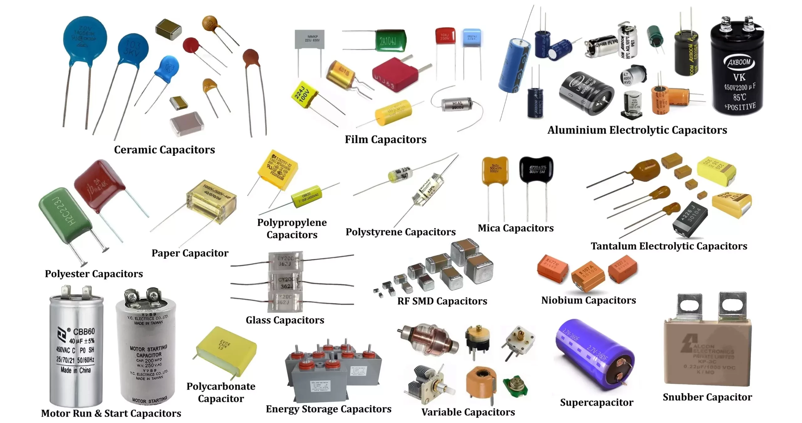
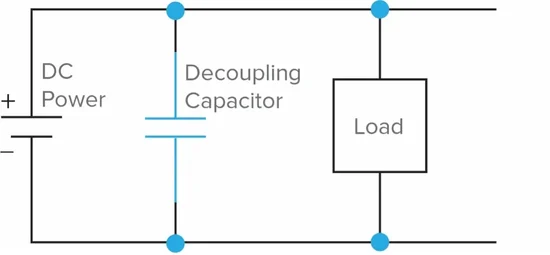

# Capacitors (10nF, 100nF, 100µF) – Passive Component

## Overview

A **capacitor** is a passive component that stores electrical energy in an electric field.

It is widely used for:

- Filtering noise
- Stabilizing voltage
- Timing circuits
- Energy buffering

In this course it is used to:

- Decouple power supply (noise filtering)
- Smooth signals
- Work with RC circuits
- Stabilize analog readings

---

## Image

---

## Key Specifications

Typical values used in this course:

- **10nF (0.01µF)** – small signal filtering
- **100nF (0.1µF)** – decoupling (most important)
- **100µF** – bulk energy storage

Types:

- Ceramic (10nF, 100nF)
- Electrolytic (100µF)

---

## How It Works

A capacitor stores charge:

\[
Q = C \cdot V
\]

Where:

- Q = charge (Coulombs)
- C = capacitance (Farads)
- V = voltage

---

## Basic Behavior

- Blocks DC (after charging)
- Passes AC (depending on frequency)
- Reacts to voltage changes

---

## Charging and Discharging (RC Circuit)

Voltage over time:

\[
V(t) = V_{cc} \cdot \left(1 - e^{-t/RC}\right)
\]

---

## Time Constant

\[
\tau = R \cdot C
\]

- After **1τ** → ~63% charged
- After **5τ** → ~99% charged

---

## Typical Use of Values in This Course

| Value | Use Case |
|------|----------|
| 10nF | High-frequency noise filtering |
| 100nF | Power supply decoupling |
| 100µF | Bulk smoothing, power stabilization |

---

## Decoupling Capacitor (Very Important)

Used near MCU power pins:

Purpose:
- Remove high-frequency noise
- Stabilize voltage
- Prevent MCU resets

---

## Bulk Capacitor

Placed on power rail:

- Example: **100µF**
- Smooths voltage dips
- Supports sudden current spikes

---

## Capacitor Polarity

### Ceramic Capacitors (10nF, 100nF)

- **Non-polarized**
- Can be connected in any direction

### Electrolytic Capacitors (100µF)

- **Polarized**
- Markings:
    - Long leg → **+**
    - Stripe → **−**

⚠ Wrong polarity can destroy the capacitor

---

## Frequency Behavior

Capacitor impedance:

\[
X_C = \frac{1}{2\pi f C}
\]

- High frequency → low impedance
- Low frequency → high impedance

---

## Typical Use in This Course

- Power supply stabilization (100nF)
- ADC noise filtering
- Button debounce (RC)
- Signal smoothing
- Timing experiments

---

## Common Student Mistakes

- Forgetting decoupling capacitors
- Wrong polarity (electrolytic)
- Using wrong value
- Placing capacitor too far from MCU
- Expecting capacitor to behave like resistor

---

## Advantages

- Simple and cheap
- Essential for stable circuits
- Works across many applications

---

## Limitations

- Limited energy storage
- Value tolerance can vary
- Electrolytic capacitors age over time

---

## Summary

Capacitors are essential passive components:

- Store and release energy
- Filter noise
- Stabilize voltage
- Enable timing behavior (RC circuits)

The most important takeaway:

- **Always use 100nF decoupling near MCU**
