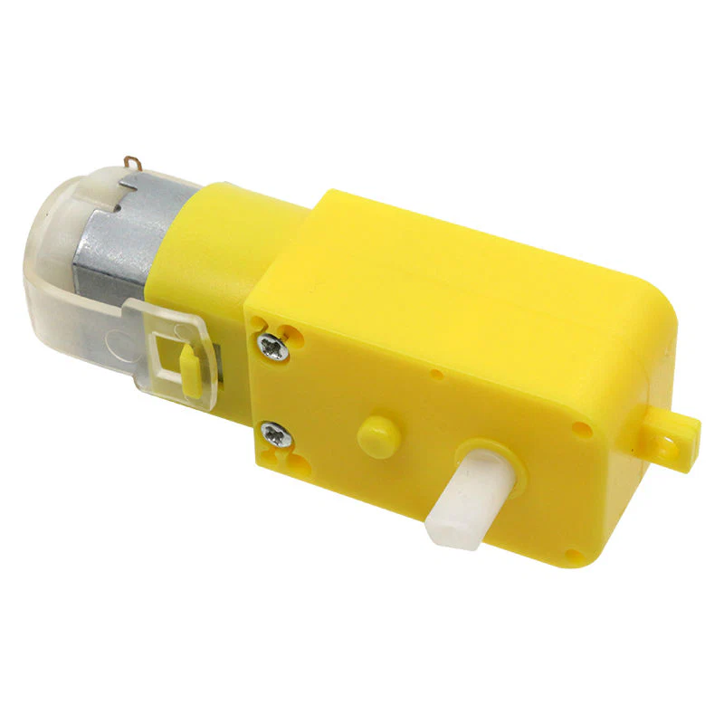
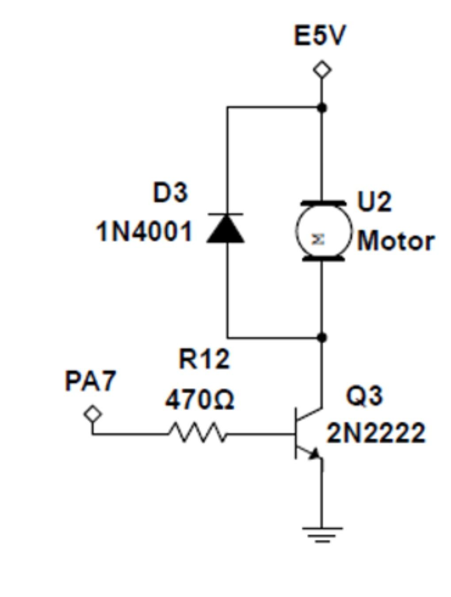

# DC Motor - Brushed Motor Actuator

## Overview

A **DC motor** converts electrical energy into rotation.

It is one of the simplest actuators used in embedded systems, but it cannot be connected directly to a microcontroller pin.

In this course it is used to:

- Practice BJT transistor or MOSFET switching
- Learn PWM speed control
- Understand inductive load protection
- Build simple motion-control experiments

---

## Image

---

## Key Specifications

- Type: Brushed DC motor
- Supply voltage: commonly **3V - 6V** for small hobby motors
- Current: depends heavily on load
- Start current: can be several times higher than running current
- Control: ON/OFF or PWM
- Polarity: reversing polarity reverses rotation direction

⚠ Always check the motor voltage and current before connecting it.

---

## How It Works

A brushed DC motor contains coils, magnets, brushes, and a commutator.

When voltage is applied:

- Current flows through the motor windings
- Magnetic force creates torque
- The rotor spins
- Current changes as the rotor moves

Motor current is not constant. It is usually highest when the motor starts or stalls.

---

## Basic Circuit / Connection

Typical low-side switching circuit:

- Motor positive terminal -> external motor supply
- Motor negative terminal -> collector/drain of transistor or MOSFET
- Emitter/source -> GND
- GPIO -> base/gate through proper resistor if required
- Flyback diode across motor terminals

The MCU and motor supply must share **common ground**.

---

## Important Electrical Notes

- Never power a motor directly from an MCU GPIO pin.
- Use a transistor, MOSFET, or motor driver.
- Use a separate motor supply when the motor current is high.
- Always add a flyback diode for a single-direction brushed motor.
- Motor noise can reset the MCU if power wiring is weak.
- Add a capacitor near the motor or driver if the signal is noisy.
- For direction control, use an H-bridge driver instead of one transistor.

---

## Basic Calculations

### Current

Using Ohm's law as a rough idea:

\[
I = \frac{V}{R}
\]

Motor winding resistance is low, so startup and stall current can be large.

Example:

- Motor supply: 5V
- Measured winding resistance: 5 ohm

\[
I_{stall} = \frac{5}{5} = 1A
\]

The driver and power supply must handle this current.

### Driver Power Dissipation

For a BJT switch:

\[
P = V_{CE} \cdot I
\]

For a MOSFET switch:

\[
P = I^2 \cdot R_{DS(on)}
\]

This is why a suitable MOSFET is usually better for larger motor currents.

---

## PWM Speed Control

Motor speed can be controlled with **PWM**.

- Higher duty cycle -> faster motor
- Lower duty cycle -> slower motor
- 0% duty cycle -> OFF
- 100% duty cycle -> full power

Use a PWM frequency high enough to avoid annoying audible noise when possible.

---

## Typical Use in This Course

- GPIO-controlled motor ON/OFF
- PWM speed control
- Transistor and MOSFET driver practice
- Demonstrating flyback protection
- Comparing motor control with servo control

---

## Common Student Mistakes

- Connecting the motor directly to GPIO
- Forgetting the flyback diode
- Using USB power for a motor that needs too much current
- Not sharing ground between MCU and motor supply
- Ignoring stall current
- Trying to reverse direction without an H-bridge

---

## Advantages

- Simple and cheap
- Easy to control speed with PWM
- Good for learning power switching
- Available in many sizes

---

## Limitations

- No built-in position feedback
- Startup current can be high
- Electrical noise is common
- Direction control requires an H-bridge
- Speed changes with load

---

## Summary

The DC motor is a basic actuator:

- Converts voltage and current into rotation
- Requires a driver circuit
- Needs flyback protection
- Supports PWM speed control
- Must be designed around real motor current, especially stall current
