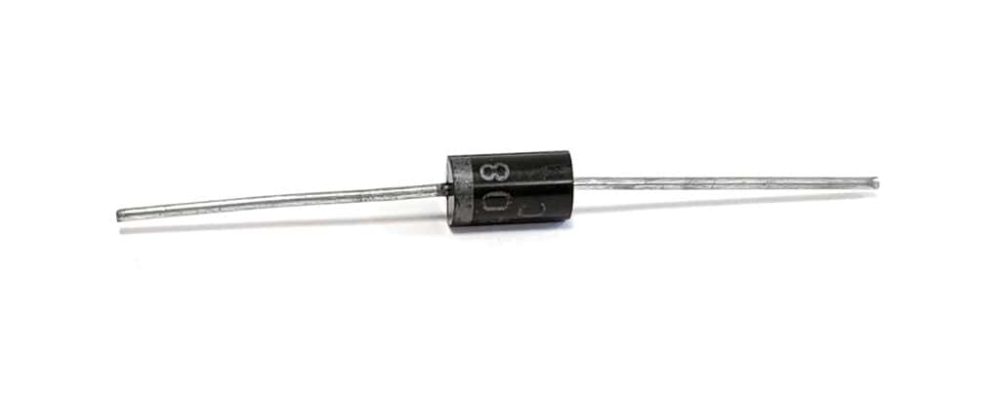
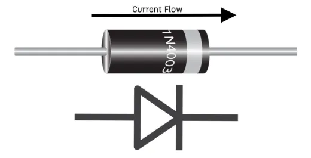
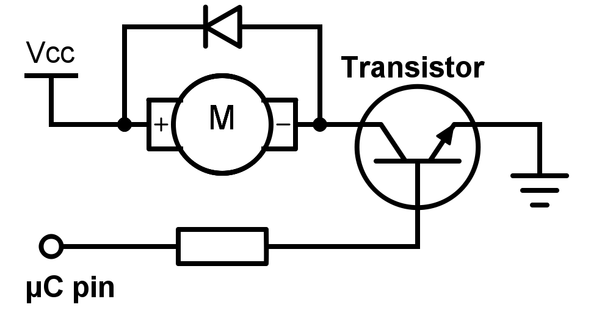

# Diode (1N4001 / 1N4007) – Protection Component

## Overview

A **diode** is a semiconductor component that allows current to flow **in one direction only**.

It is primarily used for:

- Protection
- Rectification
- Preventing reverse current

In this course it is used to:

- Protect circuits from reverse polarity
- Protect against inductive spikes (motors, relays)
- Understand basic semiconductor behavior

---

## Image

---

## Key Specifications

Typical models: **1N4001 / 1N4007**

- Type: General-purpose rectifier diode
- Forward voltage drop: **~0.7V**
- Maximum current: **~1A**
- Reverse voltage:
    - 1N4001 → ~50V
    - 1N4007 → ~1000V

⚠ For low-voltage circuits, both behave similarly

---

## Polarity

- **Anode (+)** → current enters
- **Cathode (−)** → marked with stripe

---

## How It Works

- Forward bias → conducts (current flows)
- Reverse bias → blocks current

---

## Voltage Drop

When conducting:

\[
V_{diode} \approx 0.7V
\]

Example:

- Supply: 5V
- After diode: ~4.3V

---

## Basic Use Cases

### 1. Reverse Polarity Protection

- Prevents damage if power is reversed
- Voltage drop reduces supply slightly

---

### 2. Flyback Diode (Very Important)

Used with inductive loads (motor, relay):

Purpose:

- Protect MCU from voltage spikes
- Clamp inductive kickback

---

## Current Through Diode

Same as circuit current when forward biased:

\[
I_{diode} = I_{load}
\]

Must not exceed diode rating (~1A)

---

## Power Dissipation

\[
P = V \cdot I
\]

Example:

\[
P = 0.7V \cdot 0.1A = 0.07W
\]

---

## Important Notes

- Diodes are **polarized**
- Wrong direction → no current
- Reverse voltage must not exceed rating

---

## Typical Use in This Course

- Motor/relay protection
- Power input protection
- Understanding current direction
- Simple rectification experiments

---

## Common Student Mistakes

- Reversed diode → circuit does not work
- Forgetting flyback diode → MCU resets/damage
- Ignoring voltage drop
- Using wrong diode type

---

## Advantages

- Simple and robust
- Essential for protection
- Cheap and widely available

---

## Limitations

- Voltage drop (~0.7V)
- Cannot control current (only direction)
- Slow compared to fast diodes (not for high-frequency)

---

## Summary

The diode is a fundamental protection component:

- Allows current in one direction
- Protects circuits from reverse voltage
- Essential for working with inductive loads
