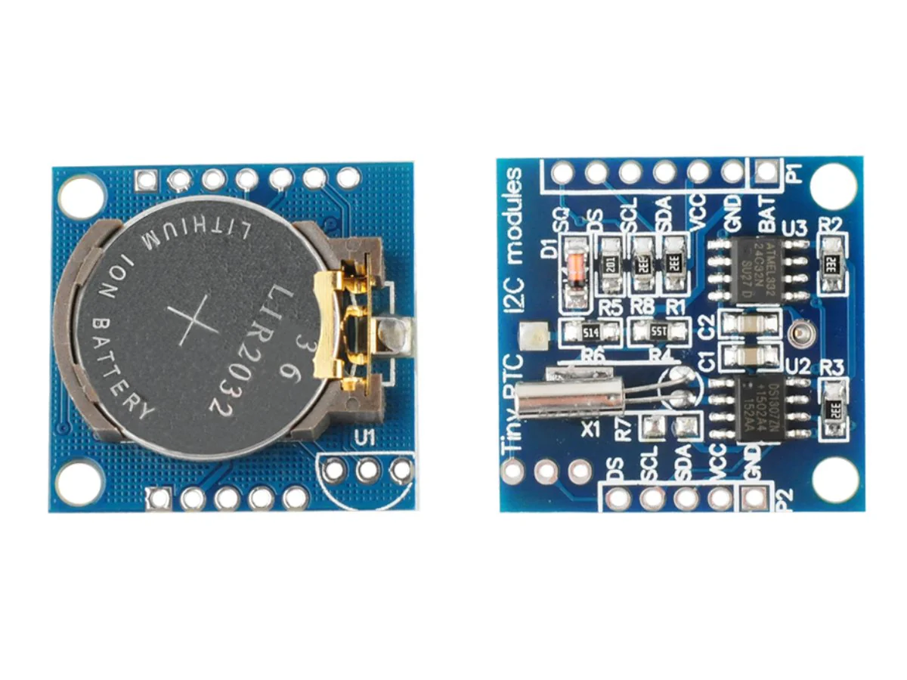
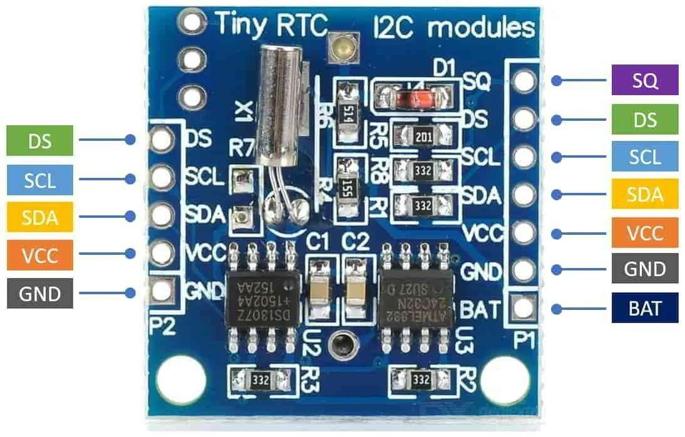

# DS1307 RTC Module - Real-Time Clock

## Overview

The **DS1307 RTC** is a real-time clock module used to keep track of time while the main microcontroller is powered off.

It uses a backup coin-cell battery and communicates over I2C.

In this course it is used to:

- Practice I2C communication
- Read and set date/time values
- Learn battery-backed peripherals
- Display time on an OLED
- Build simple data logging examples

---

## Image

---

## Key Specifications

- Type: Real-time clock module
- Main supply voltage: typically **5V** for many DS1307 modules (3V3 compatible)
- I2C address: **0x68**
- Backup battery: usually **CR2032**
- Timekeeping: seconds, minutes, hours, day, date, month, year
- Clock source: **32.768kHz crystal**
- Optional output: square-wave pin

⚠ The DS1307 chip is a 5V part. Check module pull-ups before connecting I2C lines to a 3.3V MCU.

---

## How It Works

The DS1307 counts time using a 32.768kHz crystal.

The module:

- Stores time and date in internal registers
- Keeps running from the backup battery when main power is off
- Communicates with the MCU over I2C
- Uses BCD format internally for time values

Most libraries handle the BCD conversion automatically.

---

## Basic Circuit / Connection

Typical wiring:

| DS1307 Pin | ESP32-S3 / STM32F411 Connection | Notes |
|------------|----------------------------------|-------|
| VCC | 5V or module-required supply | Check module |
| GND | GND | Common ground |
| SDA | I2C SDA | Check pull-up voltage |
| SCL | I2C SCL | Check pull-up voltage |
| SQW | Optional GPIO input | Square-wave output |

For 3.3V boards, make sure SDA and SCL are not pulled up to 5V.

---

## Important Electrical Notes

- I2C address is fixed at **0x68**.
- Many DS1307 modules have pull-up resistors to VCC.
- If VCC is 5V and pull-ups go to 5V, use a level shifter or modify the pull-ups.
- The backup battery keeps the clock running, but it should not power the whole module.
- The RTC must be set at least once before it can report the correct time.
- DS1307 is less accurate than temperature-compensated RTCs such as DS3231.

---

## Basic Calculations

### I2C Pull-up Current

For a 4.7k ohm pull-up to 3.3V:

\[
I = \frac{3.3}{4700} \approx 0.7mA
\]

For a pull-up to 5V:

\[
I = \frac{5}{4700} \approx 1.1mA
\]

The current is not the main problem. The voltage level is. A 5V pull-up can damage or stress 3.3V-only GPIO pins.

### Clock Drift

If an RTC drifts 20ppm:

\[
20ppm = 20 \text{ seconds per } 1,000,000 \text{ seconds}
\]

That is roughly:

\[
1.7 \text{ seconds per day}
\]

Real modules can be better or worse depending on crystal quality and temperature.

---

## Typical Use in This Course

- Set the RTC time from firmware
- Read date and time over I2C
- Display time on SSD1306 OLED
- Timestamp sensor measurements
- Compare RTC timekeeping with MCU timers

---

## Common Student Mistakes

- Forgetting to install the backup battery
- Not setting the RTC time before reading it
- Using 5V I2C pull-ups with 3.3V GPIO pins
- Mixing up SDA and SCL
- Expecting perfect long-term accuracy
- Ignoring the fixed I2C address when multiple devices are used

---

## Advantages

- Keeps time while MCU is off
- Simple I2C interface
- Very common module
- Useful for logging and clocks
- Includes battery backup

---

## Limitations

- DS1307 usually needs 5V supply
- I2C pull-up voltage must be checked
- Less accurate than DS3231
- Requires a coin-cell battery
- Does not know real time until set

---

## Datasheet

Analog Devices / Maxim DS1307 datasheet:

[https://www.analog.com/media/en/technical-documentation/data-sheets/ds1307.pdf](https://www.analog.com/media/en/technical-documentation/data-sheets/ds1307.pdf)

---

## Summary

The DS1307 RTC module is used for timekeeping:

- Communicates over I2C at address 0x68
- Uses a backup battery
- Must be checked carefully with 3.3V boards
- Is useful for clocks, logs, and timestamped sensor projects
