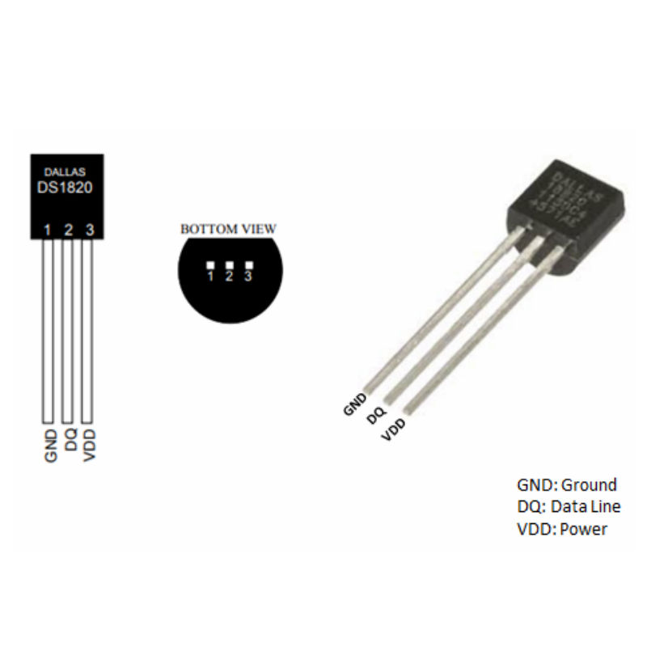
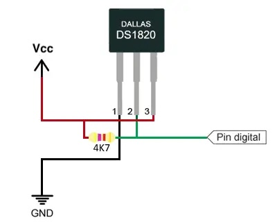

# DS18B20 - Digital Temperature Sensor

## Overview

The **DS18B20** is a digital temperature sensor that communicates over a **1-Wire** bus.

It is popular because multiple sensors can share one data line, and waterproof probe versions are easy to find.

In this course it is used to:

- Practice digital sensor communication
- Learn pull-up resistor usage
- Read temperature from a remote sensor
- Compare digital sensors with analog thermistors

---

## Image

---

## Key Specifications

- Type: Digital temperature sensor
- Supply voltage: **3.0V - 5.5V**
- Logic level in this course: **3.3V**
- Interface: **1-Wire**
- Temperature range: **-55 degrees C to +125 degrees C**
- Typical accuracy: **+/-0.5 degrees C** from -10 degrees C to +85 degrees C
- Resolution: **9 to 12 bits**
- Required pull-up: typically **4.7k ohm** on data line

---

## How It Works

The DS18B20 sends digital data on one signal wire.

The bus uses an open-drain style signal:

- Devices pull the data line LOW
- A resistor pulls the line HIGH when no device is pulling it LOW
- Each sensor has a unique 64-bit address

Because each sensor has its own address, several DS18B20 sensors can share the same GPIO pin.

---

## Basic Circuit / Connection

Typical wiring:

| DS18B20 Pin | Connection | Notes |
|-------------|------------|-------|
| VDD | 3.3V | Normal powered mode |
| GND | GND | Common ground |
| DQ | GPIO input/output | Add 4.7k ohm pull-up to 3.3V |

For waterproof probes, wire colors are often:

| Wire Color | Function |
|------------|----------|
| Red | VDD |
| Black | GND |
| Yellow / White | DQ |

⚠ Always verify the probe wiring before powering it.

---

## Important Electrical Notes

- Use a **4.7k ohm pull-up** from DQ to 3.3V.
- Do not pull the data line up to 5V when connected to a 3.3V MCU.
- Use normal powered mode for beginner projects.
- Parasite power mode is possible, but it is more difficult to debug.
- Long cables may need slower timing, stronger pull-up, or cleaner wiring.
- Waterproof probes are not always high quality; test them before using in a project.

---

## Basic Calculations

### Pull-up Current

When the data line is LOW:

\[
I = \frac{V}{R}
\]

With 3.3V and 4.7k ohm:

\[
I = \frac{3.3}{4700} \approx 0.7mA
\]

This is safe for the sensor and MCU GPIO.

### Temperature Resolution

Higher resolution gives smaller steps but longer conversion time.

| Resolution | Step Size | Typical Conversion Time |
|------------|-----------|-------------------------|
| 9-bit | 0.5 degrees C | 93.75ms |
| 10-bit | 0.25 degrees C | 187.5ms |
| 11-bit | 0.125 degrees C | 375ms |
| 12-bit | 0.0625 degrees C | 750ms |

---

## Typical Use in This Course

- Read temperature using a 1-Wire library
- Display temperature on OLED
- Compare DS18B20 readings with thermistor readings
- Use multiple temperature sensors on one pin
- Practice non-blocking timing while waiting for conversion

---

## Common Student Mistakes

- Forgetting the 4.7k ohm pull-up resistor
- Pulling DQ up to 5V on a 3.3V board
- Mixing up waterproof probe wires
- Reading too quickly before conversion is finished
- Using parasite power mode accidentally
- Not sharing ground with the MCU

---

## Advantages

- Digital temperature output
- Good beginner accuracy
- Multiple sensors can share one pin
- Waterproof probe versions are common
- Works well with 3.3V systems

---

## Limitations

- 1-Wire timing is stricter than simple GPIO
- Conversion can take up to 750ms at 12-bit resolution
- Requires a pull-up resistor
- Long cables can be unreliable without careful wiring
- Measures temperature only

---

## Datasheet

Analog Devices / Maxim DS18B20 datasheet:

[https://www.analog.com/media/en/technical-documentation/data-sheets/ds18b20.pdf](https://www.analog.com/media/en/technical-documentation/data-sheets/ds18b20.pdf)

---

## Summary

The DS18B20 is a practical digital temperature sensor:

- Uses a 1-Wire bus
- Needs a pull-up resistor on DQ
- Can share one GPIO with multiple sensors
- Is easier to calibrate than many analog temperature circuits
- Is useful for learning digital sensor timing and addressing
