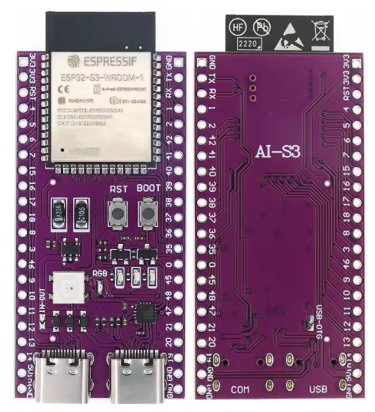
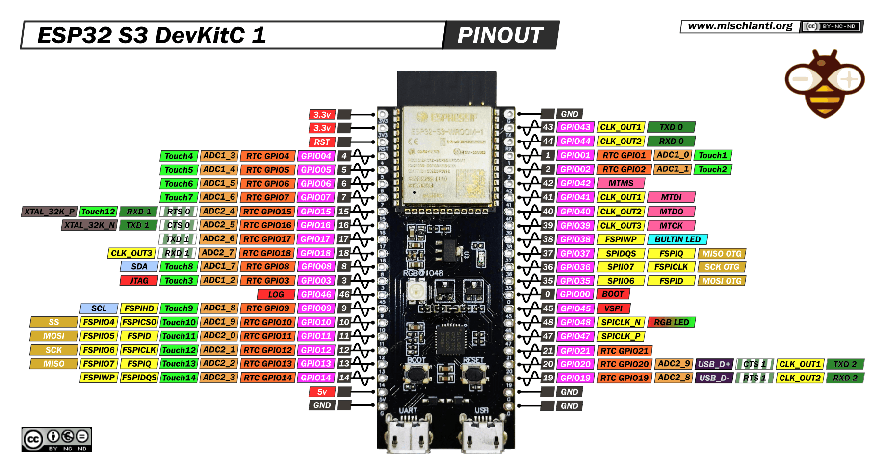

# ESP32-S3 N16R8 – Development Board

## Overview

The ESP32-S3 N16R8 is the primary development board used in this course.

It is based on the ESP32-S3 microcontroller and provides:

- WiFi + Bluetooth LE
- Multiple GPIO interfaces
- ADC / PWM / UART / I2C / SPI
- Native USB support

In this course it is used to practice:
- Embedded C development (ESP-IDF)
- Peripheral drivers
- FreeRTOS
- State machines
- Communication protocols

---

## Image

---

## Key Specifications

- MCU: ESP32-S3 (Xtensa dual-core)
- Flash: **16 MB**
- PSRAM: **8 MB**
- Logic level: **3.3V**
- WiFi: 2.4 GHz
- Bluetooth LE
- USB Type-C

⚠ All GPIO operate at **3.3V logic**.

---

## Important Electrical Limits

- Maximum GPIO voltage: **3.3V**
- Recommended max current per GPIO: ~20 mA
- Total current across all GPIO must be limited
- Never power motors directly from GPIO

Always use common ground between modules.

---

## Commonly Used Peripherals in Course

| Peripheral | Notes |
|------------|-------|
| GPIO | Digital input/output |
| ADC | Analog sensor reading |
| PWM (LEDC) | Servo / motor control |
| I2C | Sensors, OLED |
| SPI | Displays, sensors |
| UART | Debugging / external MCU |
| Timers | Periodic tasks |
| Interrupts | Encoder, button |

---

## Pinout

---

## Important Pins

⚠ Pin mapping depends on board revision.

Typical usage:

- I2C: Any GPIO (software configurable)
- UART0: Used by USB for flashing and logging
- ADC: Check ESP32-S3 ADC capable pins
- PWM: Most GPIO support LEDC

Avoid using:
- Boot configuration pins incorrectly
- Strapping pins without understanding their function

---

## Power Options

- USB Type-C (5V input)
- 5V pin (if provided)
- 3.3V regulated output available on board

⚠ Do not feed external 5V into GPIO pins.

---

## Boot Modes

Board enters bootloader mode when:
- BOOT button pressed during reset

Used for:
- Flashing firmware
- Recovery

---

## Common Student Mistakes

- Applying 5V to GPIO
- Forgetting common ground
- Powering servo directly from board 3.3V rail
- Using wrong serial port
- Using GPIO reserved for flash or USB

---

## Typical Use in This Course

- I2C communication with BME280 and SSD1306
- UART communication with STM32
- PWM control of SG90 servo
- Reading analog sensors (LDR, NTC)
- Interrupt handling for encoder
- Non-blocking superloop architecture
- FreeRTOS task-based design

---

## Documentation

Official documentation:
[https://www.espressif.com/en/products/socs/esp32-s3](https://www.espressif.com/en/products/socs/esp32-s3)

ESP-IDF Programming Guide:
[https://docs.espressif.com/projects/esp-idf/](https://docs.espressif.com/projects/esp-idf/)

---

## Summary

The ESP32-S3 N16R8 is a powerful 3.3V microcontroller board suitable for:

- Real embedded system development
- Communication protocol practice
- RTOS-based projects
- Sensor and actuator integration
