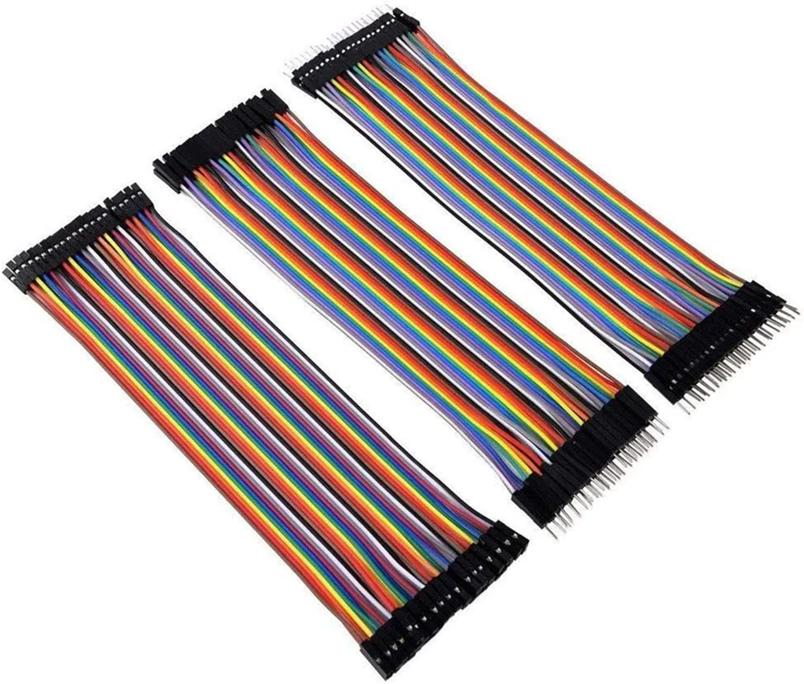

# Jumper Wires (Dupont) - Breadboard Connection Wires

## Overview

**Dupont jumper wires** are flexible wires used to connect development boards, breadboards, sensors, and modules.

They make prototyping fast, but poor jumper wiring is also one of the most common sources of embedded lab problems.

In this course they are used to:

- Connect ESP32-S3 and STM32 boards and peripherals
- Wire sensors and modules
- Build temporary test circuits
- Debug signal and power connections

---

## Image

---

## Key Specifications

- Type: Dupont jumper wires
- Pitch: **2.54mm**
- Common connector types:
    - Male-male
    - Male-female
    - Female-female
- Typical use: low-voltage signal wiring
- Course logic level: **3.3V**
- Not intended for high current

---

## What It Is Used For

Jumper wires connect points in a prototype circuit.

Common usage:

- MCU pin to breadboard row
- Breadboard row to sensor module
- GPIO pin to logic analyzer channel
- Power rail to module VCC
- Ground rail to module GND

---

## How to Use

Choose the wire type based on the connection:

| Wire Type | Typical Use |
|-----------|-------------|
| Male-male | Breadboard to breadboard, MCU header to breadboard |
| Male-female | Breadboard to module pin header |
| Female-female | Module to module, pin header to pin header |

Practical steps:

1. Select the shortest wire that comfortably reaches.
2. Connect GND first.
3. Connect power second.
4. Connect signal wires after power is clear.
5. Use consistent colors when possible.
6. Tug lightly to check for loose connections.
7. Verify important connections with continuity mode on multimeter.

---

## Important Notes / Safety

- Do not use damaged or loose jumper wires.
- Avoid using jumper wires for motor current or high-current loads.
- Keep 3.3V and 5V wires visually distinct.
- Do not plug wires while the circuit is powered if you are unsure.
- Keep wiring short for I2C, SPI, and fast digital signals.
- Always connect common ground between boards and modules.

---

## Typical Use in This Course

- Connecting LEDs, buttons, and resistors
- Wiring BME280, DS18B20, DS1307, and SSD1306 modules
- Connecting logic analyzer channels
- Building breadboard circuits
- Testing power, ground, and GPIO routing

---

## Common Student Mistakes

- Using random colors and losing track of power wires
- Forgetting GND
- Reusing broken wires
- Making long messy loops for fast signals
- Accidentally shifting a connector by one pin
- Using jumper wires for loads that need too much current

---

## Advantages

- Fast prototyping
- Reusable
- Available in many lengths
- Works with breadboards and 2.54mm headers
- Easy to rearrange during debugging

---

## Limitations

- Can become loose
- Not reliable for permanent projects
- Not good for high-current paths
- Long wires can add noise
- Connector quality varies

---

## Summary

Dupont jumper wires are essential for quick lab wiring:

- Use the correct male/female type
- Keep wires short and organized
- Use consistent colors
- Check loose connections early
- Do not use them for high-current or permanent wiring
