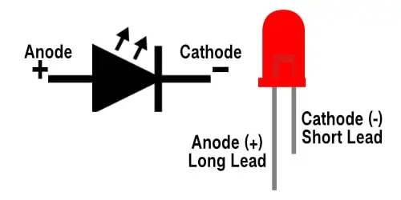
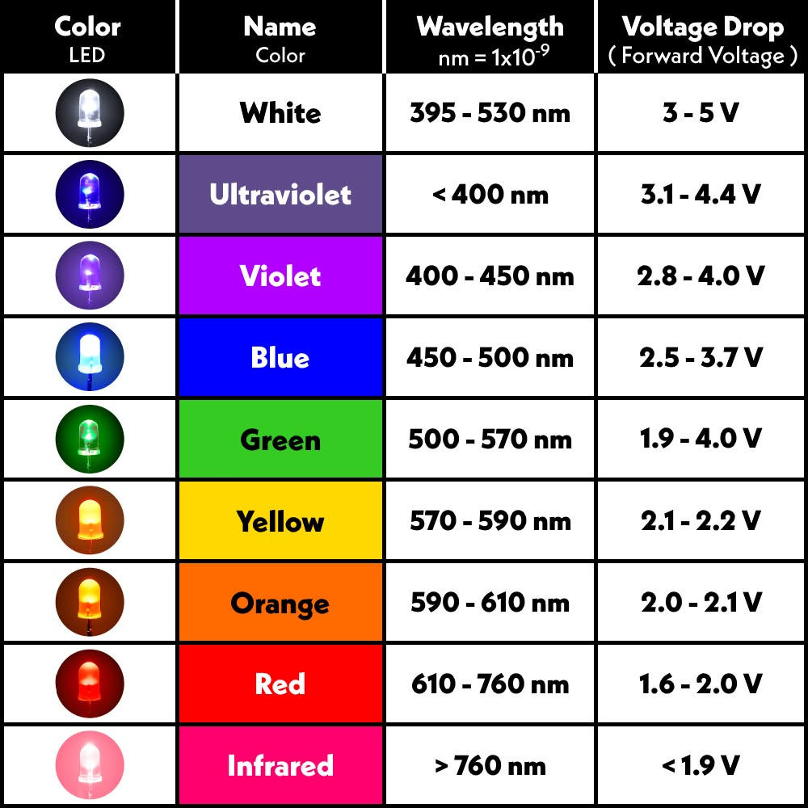
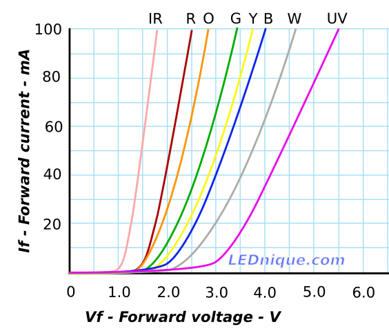

# LED (Light Emitting Diode) – Basic Output Component

## Overview

The **LED (Light Emitting Diode)** is a fundamental electronic component that emits light when current flows through it.

It is one of the most commonly used components in embedded systems for:

- Status indication
- Debugging (visual feedback)
- Basic user interface

In this course it is used to:
- Indicate MCU activity (blinking)
- Show system states
- Practice GPIO and PWM control

---

## Image

---

## Key Specifications

- Type: Semiconductor diode
- Operation: Emits light when forward biased
- Typical forward voltage:
  - Red: **~1.8–2.2V**
  - Green: **~2.0–3.0V**
  - Blue/White: **~2.8–3.3V**
- Typical current: **5–20 mA**

⚠ LEDs are **current-driven devices** → always use a resistor.

---

## Polarity

- **Anode (+)** → longer leg
- **Cathode (−)** → shorter leg, flat edge on корпус

---

## Basic Circuit

---

## Important Electrical Limits

- Maximum current: typically **20 mA**
- Recommended current: **5–10 mA** (safe for MCU)
- Reverse voltage: very low (do not reverse bias)

⚠ Connecting LED without resistor may destroy it.

---

## Basic Calculation (Series Resistor)

To safely use an LED, a **series resistor** is required.

Using **Ohm’s Law**:

$$ R = \frac{V_{supply} - V_{forward}}{I} $$

### Example (3.3V MCU, Red LED)

- Supply: 3.3V
- LED forward voltage: 2.0V
- Desired current: 10 mA (0.01 A)

$$ R = \frac{3.3 - 2.0}{0.01} = 130\ \Omega $$

Closest standard value:

- **100Ω → brighter**
- **220Ω → dimmer (recommended for safety)**

---

## Power Dissipation in Resistor

$$ P = I^2 \cdot R $$

Example (10 mA, 220Ω):

$$ P = (0.01)^2 \cdot 220 = 0.022W $$

→ Well below **0.5W resistor limit**

---

## Typical Values in This Course

| Supply | LED Color | Resistor |
|--------|----------|----------|
| 3.3V   | Red      | 100–220Ω |
| 3.3V   | Green    | 150–330Ω |
| 3.3V   | Blue     | 220–470Ω |

---

## PWM Control (Brightness)

LED brightness can be controlled using **PWM (Pulse Width Modulation)**:

- Higher duty cycle → brighter LED
- Lower duty cycle → dimmer LED

Used in:
- Dimming
- Status indication
- Effects (breathing LED)

---

## Typical Use in This Course

- Blinking LED (first program)
- Status indication (WiFi, errors)
- PWM brightness control
- Debugging (visual feedback)

---

## Common Student Mistakes

- No resistor → LED burns out
- Wrong polarity → LED does not light
- Too small resistor → too much current
- Too large resistor → LED too dim
- Connecting directly to 5V without calculation

---

## Advantages

- Simple and cheap
- Immediate visual feedback
- Useful for debugging

---

## Limitations

- Only indicates simple states
- Limited brightness control without PWM
- Requires resistor

---

## Summary

The LED is the most basic output component:

- Converts electrical signal into light
- Requires proper current limiting
- Essential for learning GPIO, PWM, and debugging
