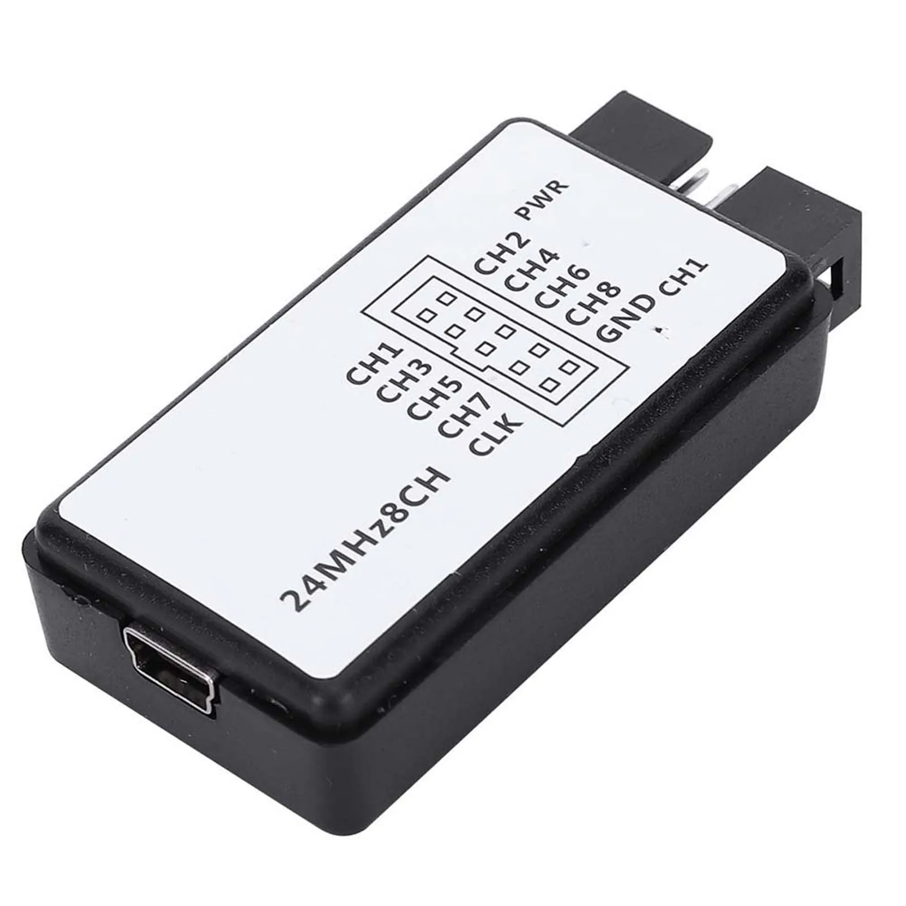
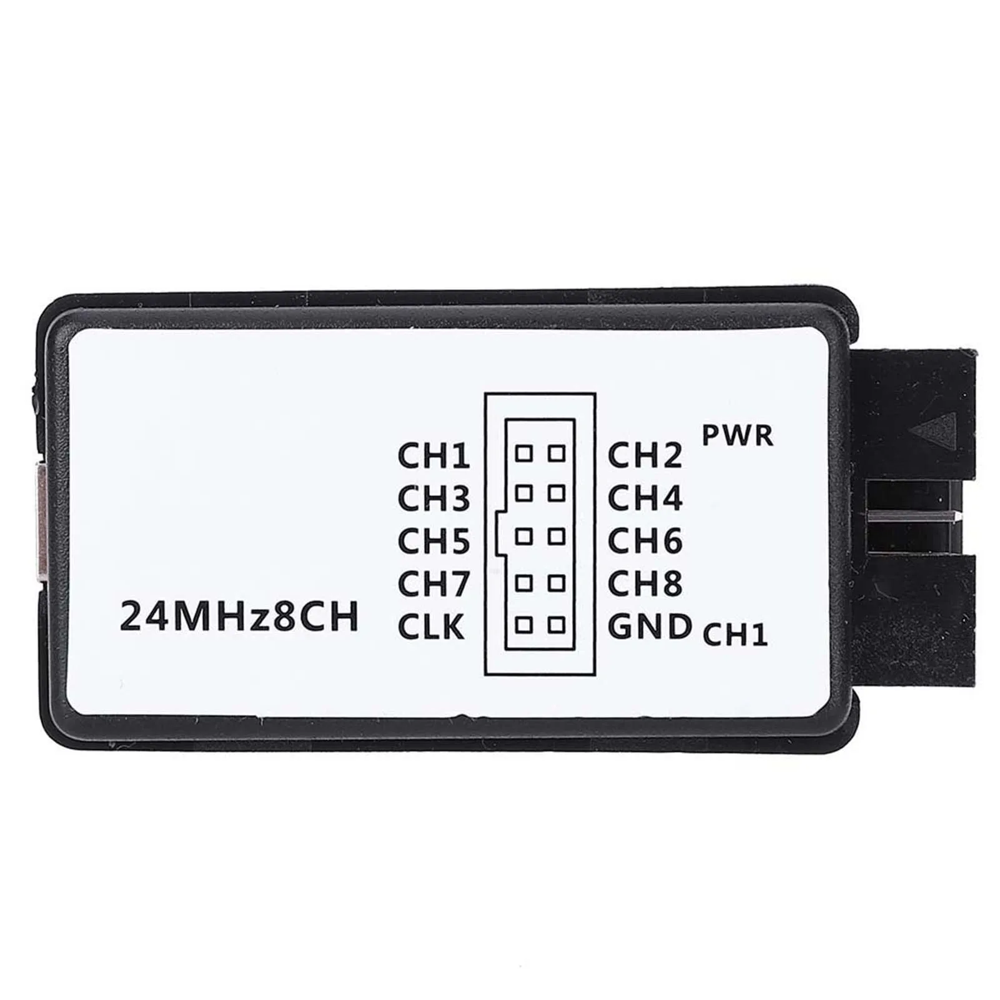
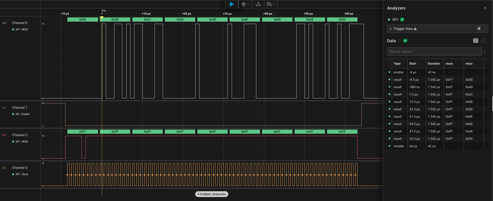

# Logic Analyzer (8-Channel, 24 MHz) – Debugging Tool

## Overview

The **8-channel 24 MHz Logic Analyzer** (commonly known as a “Saleae clone”) is a low-cost digital debugging tool used to inspect communication signals.

It allows you to:

- Capture digital signals on multiple channels
- Decode communication protocols (I2C, SPI, UART, etc.)
- Analyze timing and logic behavior

In this course it is used to:
- Debug communication between devices
- Verify protocol implementation (I2C, SPI, UART)
- Visualize timing and signal transitions
- Visualize button bounce
- Troubleshoot embedded systems

---

## Image

---

## Key Specifications

- Channels: **8 digital inputs**
- Maximum sampling rate: **24 MHz**
- Interface: USB-mini
- Compatible software:
    - Saleae Logic / Logic 2
- Supported protocols:
    - I2C
    - SPI
    - UART
    - 1-Wire
    - CAN bus
    - Custom digital decoding

⚠ Input signals are **3.3V (typically 5V tolerant, but verify your device)**.

---

## Important Electrical Limits

- Recommended input voltage: **0–3.3V**
- Some versions support 5V logic, but **do not rely on it**
- No protection against overvoltage on cheap clones

Always ensure:
- Common ground between analyzer and circuit
- Signals are within safe voltage range

---

## Commonly Used Connections

| Analyzer Pin | Target Signal | Function |
|-------------|--------------|----------|
| CH0–CH7     | GPIO lines   | Digital inputs |
| GND         | GND          | Reference |

Example:

- CH0 → I2C SDA
- CH1 → I2C SCL
- GND → GND

---

## Pinout
Pinout is shown written on the housing of the device for confort of use.

---

## Important Notes

- This is a **passive device** - it does not drive signals
- It only **observes and records**
- Multiple channels allow simultaneous signal tracking
- Sampling rate must be at least **2–4× higher** than signal frequency

---

## Software (Saleae Logic)

Supported by:

- Logic 1 (legacy)
- Logic 2 (recommended)

Features:

- Real-time signal capture
- Protocol decoding
- Measurements (timing, frequency)
- Export data for analysis

---

## Typical Workflow

1. Connect analyzer to PC via USB
2. Connect GND to target system
3. Connect channels to signals of interest
4. Open Saleae Logic software
5. Set sampling rate and channels
6. Start capture
7. Add protocol decoder (I2C/SPI/UART/etc.)

---

## Common Student Mistakes

- Not connecting GND
- Sampling too slowly -> missing data
- Wrong channel assignment
- Connecting to analog signals (this is digital only)
- Exceeding voltage limits
- Misinterpreting decoded data

---

## Typical Use in This Course

- Debugging I2C communication (BME280, SSD1306)
- Verifying SPI transactions
- Inspecting UART communication between MCUs
- Checking timing issues
- Understanding protocol behavior visually

---

## Advantages

- Very low cost
- Easy to use
- Powerful protocol decoding
- Great learning tool for digital communication

---

## Limitations

- Digital signals only (no analog measurement)
- Limited sampling rate (24 MHz max)
- Accuracy depends on sampling configuration
- No signal generation capability

---

## Documentation / Software

Saleae Logic software:

- https://www.saleae.com/downloads/

---

## Summary

The 8-channel 24 MHz Logic Analyzer is an essential debugging tool for embedded development:

- Visualizes digital communication
- Helps diagnose protocol issues
- Improves understanding of timing and signals
- Complements traditional debugging tools (UART, ST-Link)
