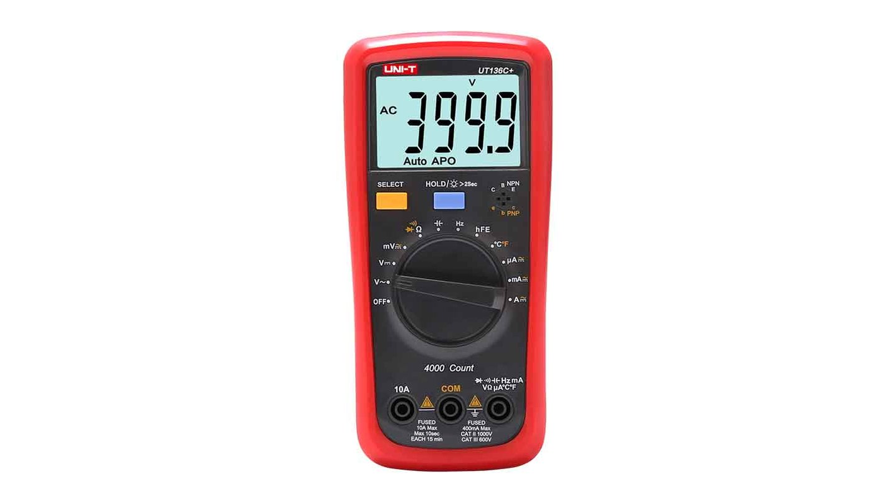

# Digital Multimeter (UNI-T UT136C+) – Measurement Tool

## Overview

The **UNI-T UT136C+** is a reliable digital multimeter used for measuring electrical parameters in embedded systems.

It allows you to:

- Measure voltage, current, and resistance
- Test continuity and diodes
- Diagnose hardware issues
- Verify circuit behavior

In this course it is used to:
- Check power supply levels
- Debug wiring and connections
- Measure sensor signals
- Verify correct operation of circuits

---

## Image

---

## Key Specifications

- Type: Digital multimeter (auto-ranging)
- Display: LCD
- Voltage measurement:
    - DC: up to **600V**
    - AC: up to **600V**
- Current measurement:
    - DC/AC: up to **10A**
- Resistance: up to **60 MΩ**
- Continuity test (buzzer)
- Diode test mode

⚠ Designed for both low-voltage electronics and basic mains measurements.

---

## Important Electrical Limits

- Maximum voltage: **600V**
- Maximum current (10A port): limited duration only
- Use correct input port for current measurement

⚠ Incorrect probe placement can damage the device or circuit.

---

## Probes and Ports

Typical ports:

| Port | Function |
|------|----------|
| COM  | Ground (black probe) |
| VΩHz | Voltage, resistance, continuity (red probe) |
| mA   | Low current measurement |
| 10A  | High current measurement |

---

## Measurement Modes

Common modes used in this course:

| Mode | Use |
|------|-----|
| DC Voltage (V⎓) | Measure MCU supply (3.3V, 5V) |
| Resistance (Ω) | Check pull-ups, resistors |
| Continuity | Check connections / wiring |
| Diode | Test polarity and components |
| Current (A) | Measure current consumption |

---

## Basic Usage

### Measuring Voltage

1. Set dial to **V⎓ (DC voltage)**
2. Black probe → GND
3. Red probe → test point
4. Read value on display

---

### Continuity Test

1. Set dial to **continuity mode**
2. Touch probes together → hear beep
3. Test connection:
    - Beep = connected
    - No sound = open circuit

---

### Measuring Resistance

1. Set dial to **Ω**
2. Ensure circuit is **powered OFF**
3. Measure across component (parallel to component)

---

### Measuring Current

⚠ Special care required:

1. Move red probe to **mA or 10A port**
2. Break the circuit
3. Insert multimeter **in series**
4. Read current

⚠ Never measure current in parallel.

---

## Typical Workflow in This Course

- Verify 3.3V and 5V rails
- Check GND connections
- Debug I2C pull-up resistors
- Test button and encoder wiring
- Measure sensor outputs
- Diagnose power issues

---

## Common Student Mistakes

- Measuring current in parallel (short circuit)
- Using wrong port (VΩ instead of A)
- Measuring resistance on powered circuit
- Forgetting to switch mode
- Not checking probe placement
- Shorting pins with probes accidentally

---

## Safety Notes

- Start with highest range if unsure
- Avoid touching metal probe tips
- Do not exceed rated voltage/current
- Be careful when working with powered circuits

---

## Advantages

- Essential debugging tool
- Easy to use
- Versatile (voltage, current, resistance)
- Reliable for lab work

---

## Limitations

- No signal visualization (unlike oscilloscope)
- Slower than logic analyzer for digital signals
- Limited precision for very small signals

---

## Documentation

Product pages:
- [Product page](https://meters.uni-trend.com/product/ut136plus-series/)
- [User manual](https://meters.uni-trend.com/product/ut136plus-series/#)
- [Datasheet](https://meters.uni-trend.com/product/ut136plus-series/#)

---

## Summary

The UNI-T UT136C+ multimeter is a fundamental tool for embedded development:

- Verifies electrical parameters
- Helps diagnose hardware issues
- Ensures safe and correct circuit operation