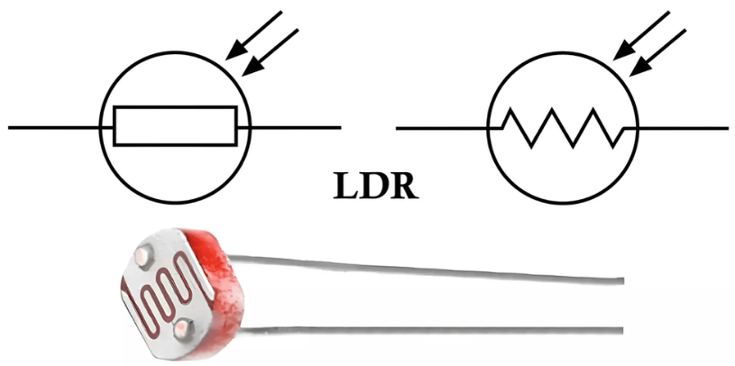
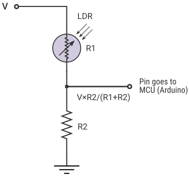

# Photoresistor (LDR) – Light Sensor

## Overview

A **photoresistor** (LDR – Light Dependent Resistor) is a passive sensor whose resistance **decreases as light intensity increases**.

It is one of the simplest analog sensors.

In this course it is used to:

- Measure ambient light using ADC
- Practice voltage dividers
- Implement threshold-based logic (day/night)
- Work with non-linear sensors

---

## Image

---

## Key Specifications

Typical models: **GL5516 / GL5506**

- Type: Light-dependent resistor
- Behavior: Resistance decreases with increasing light
- Resistance range:
    - Dark: **~100kΩ – 1MΩ**
    - Indoor light: **~10kΩ**
    - Bright light: **~1kΩ**
- Response time: relatively slow (tens of ms)

---

## How It Works

Resistance depends on light level:

| Light Level | Resistance |
|------------|-----------|
| Dark       | ~500kΩ    |
| Room light | ~10kΩ     |
| Bright     | ~1kΩ      |

---

## Basic Circuit (Voltage Divider)

---

## Voltage Calculation

\[
V_{out} = V_{cc} \cdot \frac{R_{LDR}}{R_{fixed} + R_{LDR}}
\]

As light increases:
- \(R_{LDR}\) decreases
- \(V_{out}\) decreases

---

## Choosing the Fixed Resistor

The fixed resistor should be **close to LDR resistance in normal conditions**.

### Why 10kΩ is Used in This Course

- LDR ≈ **10kΩ in typical indoor light**
- With 10kΩ divider:

\[
V_{out} \approx \frac{Vcc}{2}
\]

→ Maximum ADC sensitivity around normal conditions

Additional benefits:

- Works well with standard resistor kits
- Good balance between sensitivity, noise, and stability

---

## Typical Resistor Values for LDR (GL5516 / GL5506)

LDR resistance varies widely:

| Condition        | LDR Resistance |
|-----------------|----------------|
| Bright sunlight | ~1kΩ           |
| Indoor light    | ~5k–20kΩ       |
| Dim light       | ~50k–200kΩ     |
| Darkness        | ~500k–1MΩ      |

### Recommended Fixed Resistor Values

| Use Case            | Fixed Resistor |
|---------------------|----------------|
| Bright environments | 1kΩ – 4.7kΩ    |
| Indoor (general)    | **10kΩ**       |
| Low light / dark    | 47kΩ – 100kΩ   |

---

## Power and Current

At 3.3V with 10kΩ:

\[
I = \frac{3.3}{10k + R_{LDR}} \approx 0.1–0.3\ \text{mA}
\]

\[
P \approx 1\ \text{mW}
\]

→ Very low power consumption

---

## Non-Linear Behavior

LDR response is **logarithmic**, not linear:

- Small changes in light → large resistance change (in dark)
- Large light change → small resistance change (in bright)

---

## Methods of Using LDR Data

### 1. Raw ADC Value (Simplest)

- Use ADC directly
- Compare thresholds

Example:
- ADC < 1000 → bright
- ADC > 3000 → dark

---

### 2. Normalization

Map ADC range to percentage:

\[
Light = \frac{ADC}{ADC_{max}} \cdot 100\%
\]

---

### 3. Logarithmic Scaling (Advanced)

Approximate human perception:

\[
Light \propto \log(R)
\]

Used for:

- Better UI (smooth brightness)
- Advanced visualization

---

## Typical Use in This Course

- Day/night detection
- Automatic brightness control
- Sensor input for logic decisions
- ADC practice

---

## Common Student Mistakes

- Wrong resistor value → poor sensitivity
- Expecting linear behavior
- Ignoring environment lighting
- Floating input (missing divider)
- Not calibrating thresholds

---

## Advantages

- Very cheap
- Easy to use
- No polarity

---

## Limitations

- Slow response
- Low precision
- Strongly non-linear
- Sensitive to temperature

---

## Summary

The LDR is a simple analog light sensor:

- Converts light → resistance → voltage
- Requires voltage divider
- Best used with threshold-based logic

Ideal for learning:

- ADC
- Analog sensors
- Non-linear signal behavior
