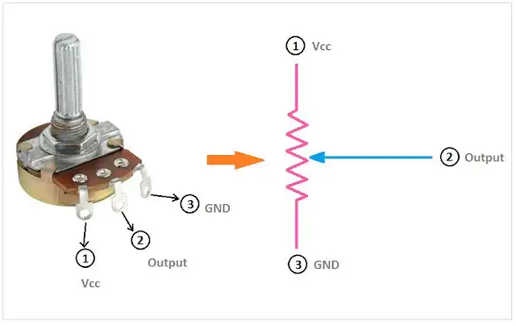
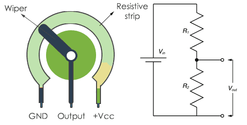
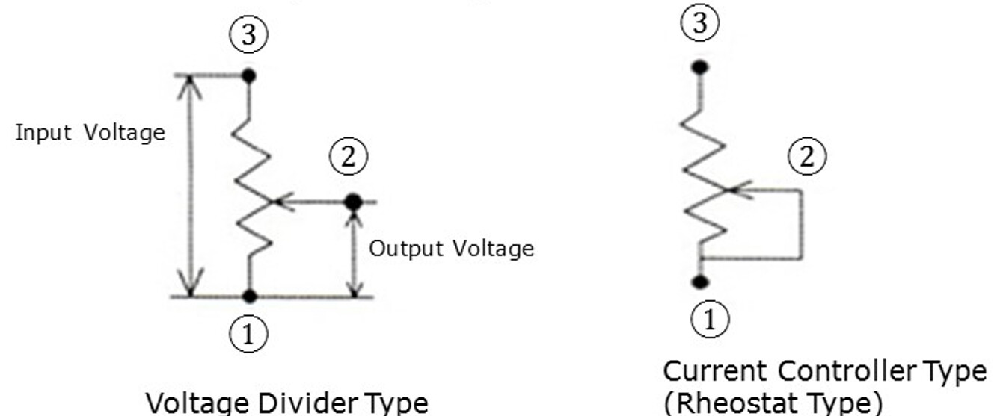

# Potentiometer (10kΩ / 20kΩ) – Adjustable Resistor

## Overview

A **potentiometer** is a variable resistor that allows manual adjustment of voltage.

It is commonly used as a **user input device**.

In this course it is used to:
- Generate analog input for ADC
- Simulate sensor values
- Control parameters (brightness, speed, thresholds)

---

## Image

---

## Key Specifications

- Type: Variable resistor (3 terminals)
- Typical values:
    - **10kΩ**
    - **20kΩ**
- Adjustment: Rotary (knob)
- Output: Analog voltage

---

## How It Works

A potentiometer consists of:
- Two fixed terminals (ends of resistor)
- One **wiper** (middle pin)

As the knob rotates:
- Wiper moves along resistive track
- Output voltage changes

---

## Basic Circuit

Connections:

- One side → VCC
- Other side → GND
- Middle pin (wiper) → ADC input

---

## Voltage Output

\[
V_{out} = V_{cc} \cdot \frac{R_{wiper}}{R_{total}}
\]

- Fully left → ~0V
- Middle → ~Vcc / 2
- Fully right → ~Vcc

---

## Why 10kΩ / 20kΩ Are Used

These values provide a good balance:

| Value | Pros | Cons |
|------|------|------|
| 1kΩ  | Stable signal | High current consumption |
| 10kΩ | Best balance | — |
| 20kΩ | Lower current | Slightly more noise |
| 100kΩ | Very low power | Noisy ADC readings |

---

## Current and Power

Example (10kΩ at 3.3V):

\[
I = \frac{3.3}{10k} = 0.33\ \text{mA}
\]

\[
P = \frac{3.3^2}{10k} \approx 1\ \text{mW}
\]

→ Safe and efficient

---

## Important Notes

- Potentiometer acts as a **voltage divider**
- Output is **linear with position**
- No polarity (for resistive track)

⚠ Wiper must be connected to ADC, not the ends

---

## Typical Use in This Course

- ADC reading practice
- User-controlled input (knob)
- Adjusting:
  - LED brightness (PWM)
  - Servo position
  - Threshold values

---

## Common Student Mistakes

- Connecting only 2 pins (wrong usage)
- Not using GND → unstable readings
- Expecting digital behavior
- Using too high resistance → noisy signal
- Miswiring wiper pin

---

## Advantages

- Simple and intuitive
- Direct human interaction
- Stable analog signal

---

## Limitations

- Mechanical wear over time
- Limited precision
- Requires ADC

---

## Summary

The potentiometer is a basic input component:

- Converts position → voltage
- Works as adjustable voltage divider
- Ideal for learning ADC and user input
