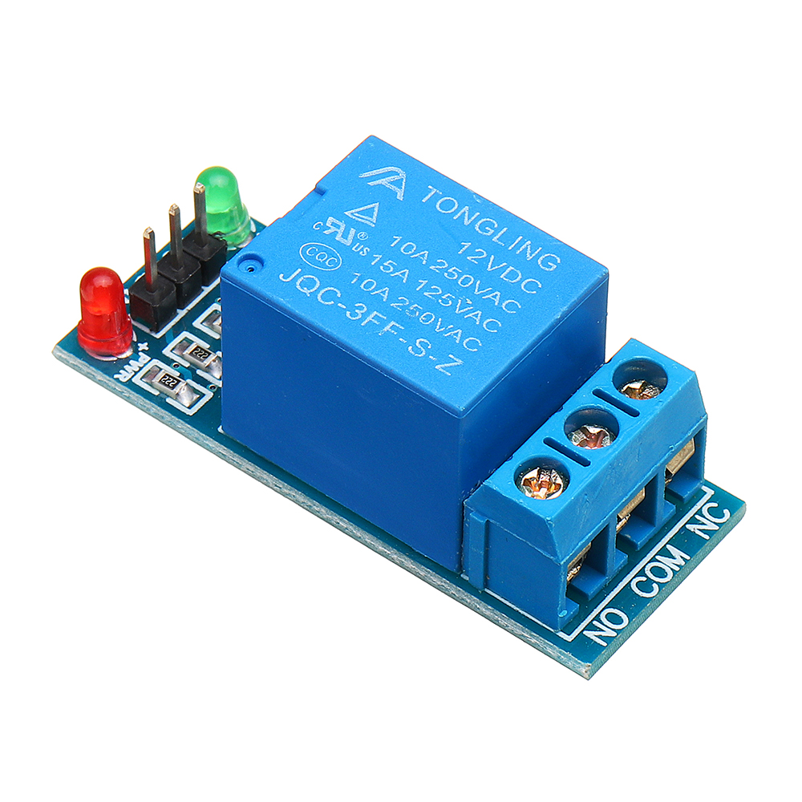
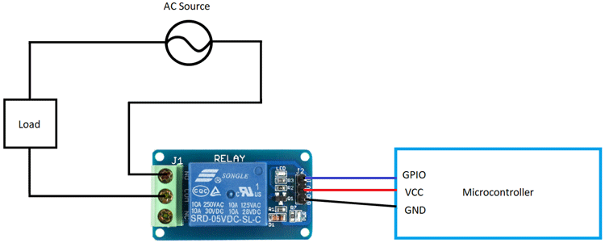

# Relay Module - Isolated Switching Module

## Overview

A **single relay module** is an electrically controlled switch.

It allows a microcontroller to control a separate circuit that may use a different voltage or a higher current than the MCU GPIO can handle.

In this course it is used to:

- Practice digital output control
- Switch external loads safely
- Understand isolation between control and load circuits
- Learn why inductive loads need protection

---

## Image

---

## Key Specifications

- Type: Electromechanical relay module
- Control input: usually **3.3V or 5V logic** depending on module
- Relay coil voltage: usually **5V**
- Load contacts: often rated around **10A at 250VAC** or **10A at 30VDC**
- Output contacts:
    - COM (Common)
    - NO (Normally Open)
    - NC (Normally Closed)
- Input behavior: many modules are **active LOW**

⚠ Contact ratings are maximum values. For beginner projects, use low-voltage DC loads whenever possible.

---

## How It Works

A relay contains a coil and mechanical contacts.

When current flows through the coil:

- A magnetic field is created
- The internal switch moves
- COM connects to NO instead of NC

Contact meanings:

| Contact | Meaning | State when relay is OFF |
|---------|---------|--------------------------|
| COM | Common terminal | Connected to NC |
| NO | Normally Open | Disconnected |
| NC | Normally Closed | Connected to COM |

---

## Basic Circuit / Connection

Typical control-side wiring:

| Relay Pin | ESP32-S3 / STM32F411 Connection |
|-----------|----------------------------------|
| VCC | 5V module supply |
| GND | GND |
| IN | GPIO output |

Typical load-side wiring:

- COM -> external power source
- NO -> load input
- Load output -> external power ground or return

Use **NO** when the load should be normally OFF.

---

## Important Electrical Notes

- A relay coil needs much more current than a GPIO pin can provide directly.
- Use a relay module with a driver transistor, flyback diode, and proper input circuit.
- Many 5V relay modules do not switch reliably from a 3.3V GPIO.
- Always connect a common ground between MCU and relay module control side, unless the module is intentionally wired for optical isolation.
- Keep mains voltage away from breadboards and beginner lab wiring.
- Relay contacts are isolated from the control input, but the PCB spacing still matters for safety.
- Mechanical relays are slow compared with transistors or MOSFETs.

---

## Basic Calculations

For relay modules, the most important calculation is usually supply current.

If the relay coil consumes 70mA from 5V:

\[
P = V \cdot I = 5 \cdot 0.07 = 0.35W
\]

This is far above what an MCU GPIO can provide.

A GPIO should only drive the module input, not the relay coil directly.

---

## Typical Use in This Course

- Turning a low-voltage load ON and OFF
- Learning active LOW output behavior
- Understanding COM, NO, and NC contacts
- Comparing relay switching with transistor switching

---

## Common Student Mistakes

- Powering the relay coil from a GPIO pin
- Forgetting common ground on the control side
- Assuming every relay module accepts 3.3V input
- Wiring the load to NC when NO was intended
- Switching too fast and wearing out the relay
- Using a breadboard for high-current or mains loads

---

## Advantages

- Provides electrical isolation between control and load circuits
- Can switch AC or DC loads
- Easy to understand as an actual switch
- Useful for learning load control

---

## Limitations

- Mechanical wear over time
- Makes clicking noise
- Slow switching speed
- Coil consumes noticeable current
- Not suitable for PWM speed or brightness control

---

## Summary

The single relay module is a practical output module:

- Uses a small GPIO signal to switch a separate load
- Has COM, NO, and NC contacts
- Requires correct module supply and safe wiring
- Good for ON/OFF control, not PWM
