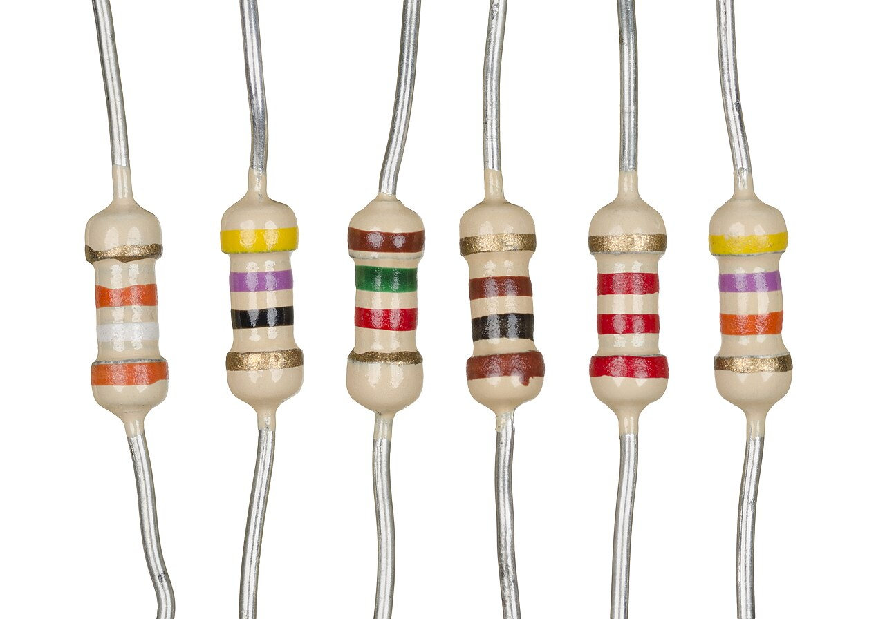
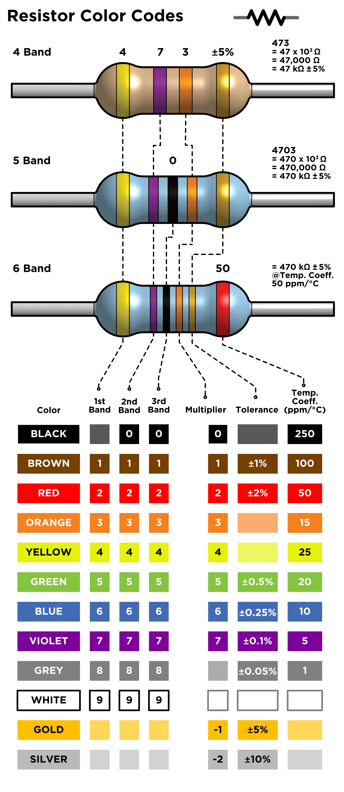
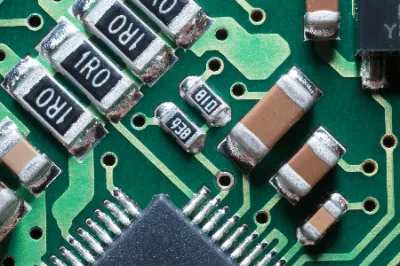
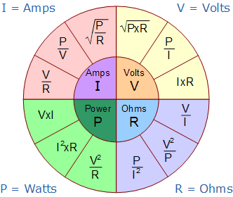
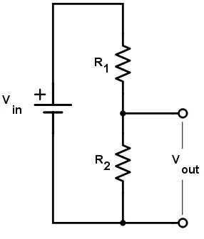
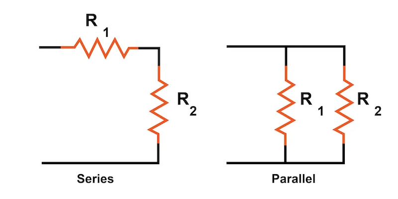

# Resistors (0.5W) – Passive Component

## Overview

A **resistor** is a passive electronic component that limits current and divides voltage in a circuit.

It is one of the most fundamental components in electronics and is used in almost every circuit.

In this course it is used to:
- Limit current (e.g., for LEDs)
- Create voltage dividers (for ADC)
- Pull-up / pull-down signals
- Set bias points in transistor circuits

---

## Image

---

## Key Specifications

- Type: Passive component
- Power rating: **0.5W**
- Resistance values used in this course:
    - **10Ω**
    - **100Ω**
    - **220Ω**
    - **1kΩ**
    - **10kΩ**
    - **100kΩ**
- Tolerance: typically **±5%**

---

## Color Code (Example)

Resistors are marked with colored bands:

| Color | Value |
|------|------|
| Black | 0 |
| Brown | 1 |
| Red | 2 |
| Orange | 3 |
| Yellow | 4 |
| Green | 5 |
| Blue | 6 |
| Violet | 7 |
| Grey | 8 |
| White | 9 |

Example:
- Red–Red–Brown → **220Ω**

---

## SMD Resistors (Surface Mount)

SMD (Surface-Mount Device) resistors are widely used in modern electronics.

Instead of color bands, they use **numeric codes** printed on the body.

⚠ Chip resistors are black. Brown ones are chip capacitors.

---

### Marking Codes

#### 3-digit code (common)

Format:
- **XY Z → (XY × 10^Z) Ω**

Examples:

| Code | Value |
|------|------|
| 101  | 100Ω |
| 102  | 1kΩ |
| 103  | 10kΩ |
| 221  | 220Ω |

---

#### 4-digit code (more precise)

Format:
- **XYZ W → (XYZ × 10^W) Ω**

Example:

| Code | Value |
|------|------|
| 1001 | 1kΩ |
| 2201 | 2.2kΩ |

---

#### Special cases

- **000** → 0Ω (jumper)
- Values < 10Ω may use:
    - **R** as decimal point
    - Example: `4R7` → 4.7Ω

---

## Important Notes

- Same electrical behavior as through-hole resistors
- Much smaller size (0603, 0805, etc.)
- Power rating is lower (typically **0.1W – 0.25W**)

---

## Why This Matters in This Course

- Many modules (ESP32, sensors) use SMD resistors
- Helps understand schematics and PCB layouts
- Useful when debugging or identifying components on boards

---

## Ohm’s Law

The most important relationship:

\[
V = I \cdot R
\]

Where:
- V = voltage (Volts)
- I = current (Amps)
- R = resistance (Ohms)

---

## Power Dissipation

Resistors convert electrical energy into heat.

\[
P = V \cdot I = I^2 \cdot R = \frac{V^2}{R}
\]

⚠ Must stay below **0.5W** rating.

---

## Example Calculation

### LED Current Limiting

Given:
- Supply: 3.3V
- LED drop: 2.0V
- Resistor: 220Ω

\[
I = \frac{3.3 - 2.0}{220} \approx 6\ \text{mA}
\]

Safe for MCU and LED.

---

## Voltage Divider

Two resistors can divide voltage:

\[
V_{out} = V_{in} \cdot \frac{R2}{R1 + R2}
\]

---

### Example

- R1 = 10kΩ
- R2 = 10kΩ
- Vin = 3.3V

\[
V_{out} = 1.65V
\]

---

## Typical Use of Values in This Course

| Value | Use Case |
|------|----------|
| 10Ω  | Current limiting (rare, high current) |
| 100Ω | LED (bright), signal protection |
| 220Ω | LED (standard safe value) |
| 1kΩ  | General purpose, base resistor |
| 10kΩ | Pull-up / pull-down, voltage divider |
| 100kΩ | High impedance sensing |

---

## E-Series (Preferred Resistor Values)

Resistors are manufactured using **standardized value series** called **E-series**.

These ensure evenly spaced values across decades.

More info:
https://en.wikipedia.org/wiki/E_series_of_preferred_numbers

---

### Common E12 Series (±10%)

Used in basic electronics (often matches student kits):

| Decade | Values |
|--------|--------|
| ×1     | 10, 12, 15, 18, 22, 27, 33, 39, 47, 56, 68, 82 |
| ×10    | 100, 120, 150, 180, 220, 270, 330, 390, 470, 560, 680, 820 |
| ×100   | 1k, 1.2k, 1.5k, 1.8k, 2.2k, 2.7k, 3.3k, 3.9k, 4.7k, 5.6k, 6.8k, 8.2k |

---

### Common E24 Series (±5%)

More precise, often used in this course:

| Decade | Values |
|--------|--------|
| ×1     | 10, 11, 12, 13, 15, 16, 18, 20, 22, 24, 27, 30, 33, 36, 39, 43, 47, 51, 56, 62, 68, 75, 82, 91 |
| ×10    | 100, 110, 120, 130, 150, 160, 180, 200, 220, 240, 270, 300, 330, 360, 390, 430, 470, 510, 560, 620, 680, 750, 820, 910 |

---

### Why This Matters

Example:

Calculated resistor:
- **130Ω**

Not available → choose nearest standard:
- **120Ω** or **150Ω**

---

## Pull-up / Pull-down Resistors

Used to define default logic level:

- Pull-up → connects to VCC
- Pull-down → connects to GND

Typical value:
- **10kΩ**

---

## Series vs Parallel

### Series

\[
R_{total} = R1 + R2
\]

### Parallel

\[
R_{total} = \frac{R1 \cdot R2}{R1 + R2}
\]

---

## Important Notes

- Resistors are **not polarized**
- Can be connected in any direction

---

## Common Student Mistakes

- Using wrong resistor value
- Ignoring power rating
- Mixing up kΩ and Ω
- Forgetting resistor for LED
- Incorrect voltage divider calculation

---

## Typical Use in This Course

- LED current limiting
- Voltage dividers (LDR, NTC)
- Pull-up/pull-down for buttons
- Transistor base resistors
- Signal conditioning

---

## Advantages

- Simple and reliable
- Essential for almost all circuits

---

## Limitations

- Dissipates energy as heat
- Fixed value

---

## Summary

Resistors are fundamental components:

- Control current and voltage
- Protect components
- Enable analog measurements
- Essential for nearly every circuit
