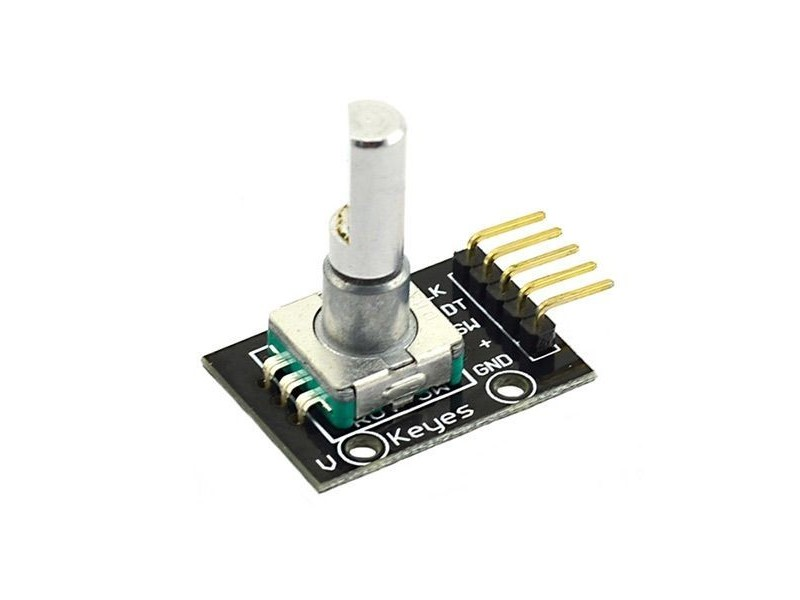
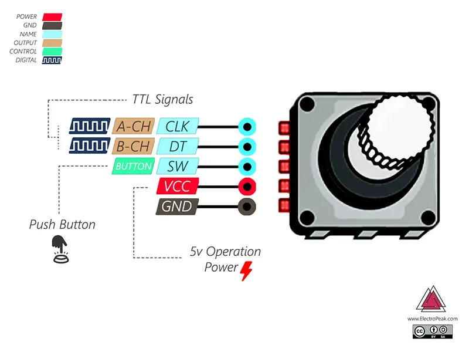

# Rotary Encoder Module (KY-040) - Incremental Input Component

## Overview

A **rotary encoder** is a digital input device that detects rotation.

Unlike a potentiometer, it does not output an analog voltage. It outputs digital pulses that tell the MCU the direction and number of steps.

In this course it is used to:

- Practice GPIO input
- Learn interrupt-based reading
- Understand quadrature signals
- Build simple menus and value controls
- Practice debouncing

---

## Image

---

## Key Specifications

- Type: Incremental mechanical rotary encoder
- Common versions: **KY-040 module**, **PEC11R encoder**
- Output signals: **A** and **B** quadrature outputs
- Optional switch: push button output
- Logic level: depends on pull-up voltage, usually **3.3V** in this course
- Typical detents: 20 or 30 steps per revolution, depending on model

---

## How It Works

The encoder has two switch outputs: A and B.

As the shaft rotates:

- A and B change state in a sequence
- The order of changes indicates direction
- The number of changes indicates movement

Example quadrature sequence:

| Direction | State Sequence |
|-----------|----------------|
| Clockwise | 00 -> 01 -> 11 -> 10 -> 00 |
| Counter-clockwise | 00 -> 10 -> 11 -> 01 -> 00 |

The push button, if present, works like a normal tact switch.

---

## Basic Circuit / Connection

⚠ 5v Operation Power - can 3V3 or other which is supported by the board.

Typical KY-040 wiring:

| Pin | Function | MCU Connection |
|-----|----------|----------------|
| CLK | Encoder A | GPIO input |
| DT | Encoder B | GPIO input |
| SW | Push button | GPIO input |
| + | Pull-up supply | 3.3V |
| GND | Ground | GND |

If using a bare PEC11R encoder, add pull-up resistors to 3.3V.

---

## Important Electrical Notes

- Use 3.3V pull-ups with ESP32-S3 and STM32F411.
- Do not pull encoder outputs up to 5V when connected directly to 3.3V GPIO pins.
- Mechanical encoders bounce and need debouncing.
- Use interrupt-capable pins if the encoder must be responsive.
- Keep wires short for reliable signals.
- The push button needs its own pull-up or pull-down configuration.

---

## Pull-up / Pull-down Explanation

Most encoder outputs behave like switches to ground.

With pull-up resistors:

- Resting open contact -> GPIO reads HIGH
- Closed contact -> GPIO reads LOW

Without pull-ups, the input can float and produce random counts.

Typical pull-up values:

- **10k ohm** for slow manual input
- **4.7k ohm** for stronger pull-up and longer wires

---

## Debouncing

Mechanical contacts do not change cleanly.

Debouncing methods:

- Software debounce with a short time filter
- State-machine decoding that accepts only valid quadrature transitions
- Optional RC filtering for very noisy hardware

For this course, software decoding is usually enough.

---

## Typical Use in This Course

- Menu navigation on an OLED display
- Adjusting PWM duty cycle
- Changing timer values
- Selecting configuration options
- Learning GPIO interrupts

---

## Common Student Mistakes

- Treating the encoder like a potentiometer
- Missing pull-up resistors
- Using 5V pull-ups with 3.3V GPIO
- Counting every bounce as a real step
- Swapping A and B and getting reversed direction
- Forgetting to debounce the push button

---

## Advantages

- Can rotate continuously
- Good for menu input
- Digital output works well with GPIO
- Direction can be detected
- Often includes a push button

---

## Limitations

- Mechanical bounce requires filtering
- More complex than a potentiometer
- Position is relative, not absolute
- Fast rotation can lose counts if software is slow

---

## Summary

The rotary encoder is a practical digital input:

- Produces quadrature pulses on A and B
- Uses pull-ups and GPIO inputs
- Needs debouncing
- Is ideal for menus, settings, and interactive embedded controls
