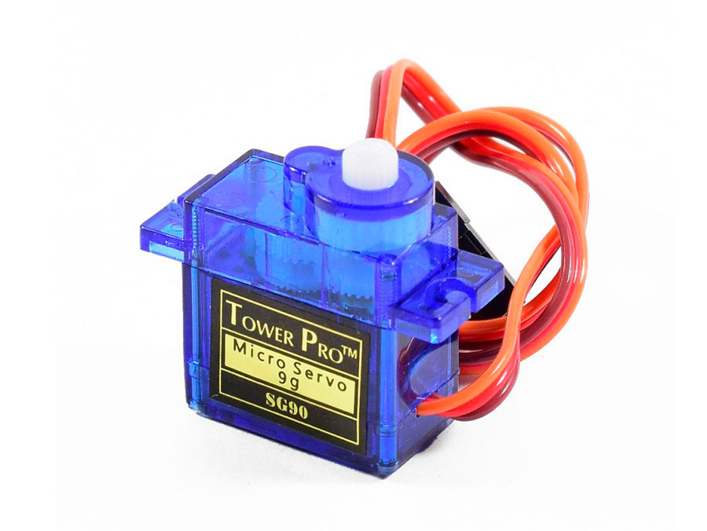
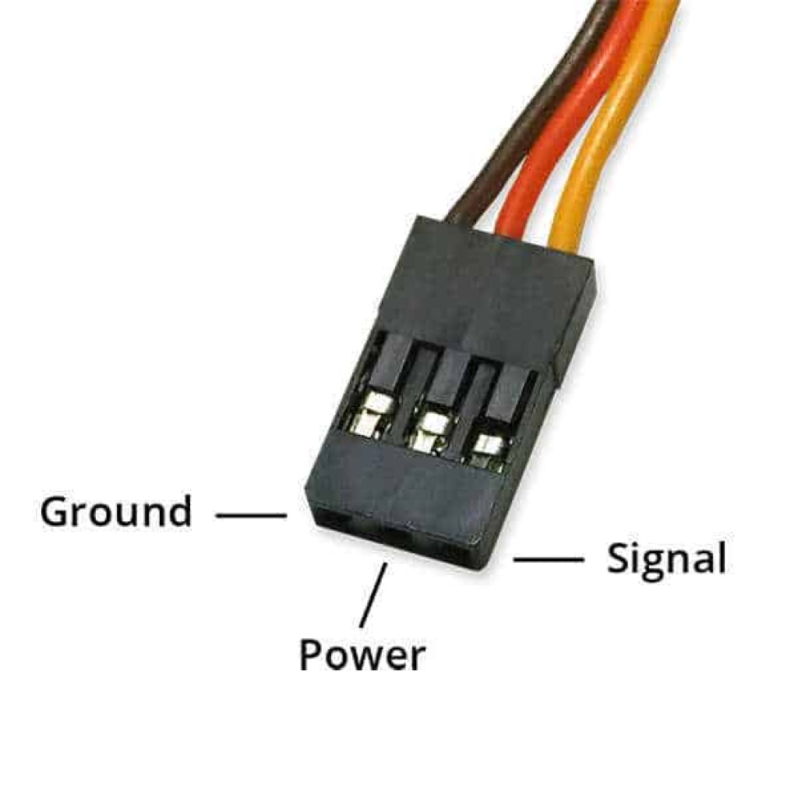

# Servo Motor SG90 - Position Control Actuator

## Overview

The **SG90 servo motor** is a small hobby servo used for simple position control.

Unlike a basic DC motor, a servo contains a motor, gearbox, position sensor, and control electronics inside one package.

In this course it is used to:

- Practice PWM-style control signals
- Move to a requested angle
- Build simple mechanical demos
- Understand separate power for actuators

---

## Image

---

## Key Specifications

- Type: Micro hobby servo
- Supply voltage: typically **4.8V - 6V**
- Signal level: usually works with **3.3V GPIO**
- Rotation range: usually **0 - 180 degrees**
- Control signal: repeating pulse, about **50Hz**
- Typical pulse width:
    - 1.0ms -> one end
    - 1.5ms -> center
    - 2.0ms -> other end

⚠ The servo power pin should not be powered from a GPIO pin.

---

## How It Works

The servo reads the width of the control pulse.

Every control period:

- A short pulse is sent on the signal wire
- The servo measures the pulse width
- Internal electronics drive the motor
- The output shaft moves toward the requested position

The signal is similar to PWM, but the important value is **pulse width**, not only duty cycle.

---

## Basic Circuit / Connection

Typical SG90 wires:

| Wire Color | Function | Connection |
|------------|----------|------------|
| Brown / Black | GND | External supply GND and MCU GND |
| Red | VCC | 5V servo supply |
| Orange / Yellow | Signal | GPIO PWM output |

⚠ Always share ground between the servo supply and the microcontroller.

---

## Important Electrical Notes

- Do not power the servo from a GPIO pin.
- Do not rely on weak 3.3V regulator output for multiple servos.
- Servo startup and movement current can be much higher than idle current.
- Add a capacitor near the servo supply if the MCU resets during movement.
- Keep mechanical load small for SG90 servos.
- Avoid forcing the servo by hand while powered.

---

## Basic Calculations

### Pulse Period

Most hobby servos use about 50Hz:

\[
T = \frac{1}{f} = \frac{1}{50} = 20ms
\]

### Duty Cycle Examples

\[
Duty = \frac{t_{pulse}}{T} \cdot 100\%
\]

For a 1.5ms center pulse:

\[
Duty = \frac{1.5ms}{20ms} \cdot 100\% = 7.5\%
\]

Typical values:

| Pulse Width | Approximate Position | Duty at 50Hz |
|-------------|----------------------|--------------|
| 1.0ms | 0 degrees | 5% |
| 1.5ms | 90 degrees | 7.5% |
| 2.0ms | 180 degrees | 10% |

---

## Typical Use in This Course

- Move servo to fixed angles
- Control servo angle using a potentiometer
- Generate timer-based PWM signals
- Learn actuator power separation

---

## Common Student Mistakes

- Powering the servo from GPIO
- Forgetting common ground
- Using the wrong PWM frequency
- Confusing duty cycle with pulse width
- Using too much mechanical load
- Connecting the signal wire to an ADC-only pin

---

## Advantages

- Easy position control
- Built-in gearbox and feedback
- Works well with simple timer output
- Good for mechanical demos

---

## Limitations

- Limited rotation range
- Not very precise under load
- Can draw high current during movement
- Not intended for continuous rotation unless modified
- Mechanical gears can wear or break

---

## Summary

The SG90 servo is a beginner-friendly position actuator:

- Uses pulse width to select angle
- Needs a proper external supply
- Usually accepts 3.3V control signals
- Is excellent for learning timers, PWM-style signals, and actuator wiring
