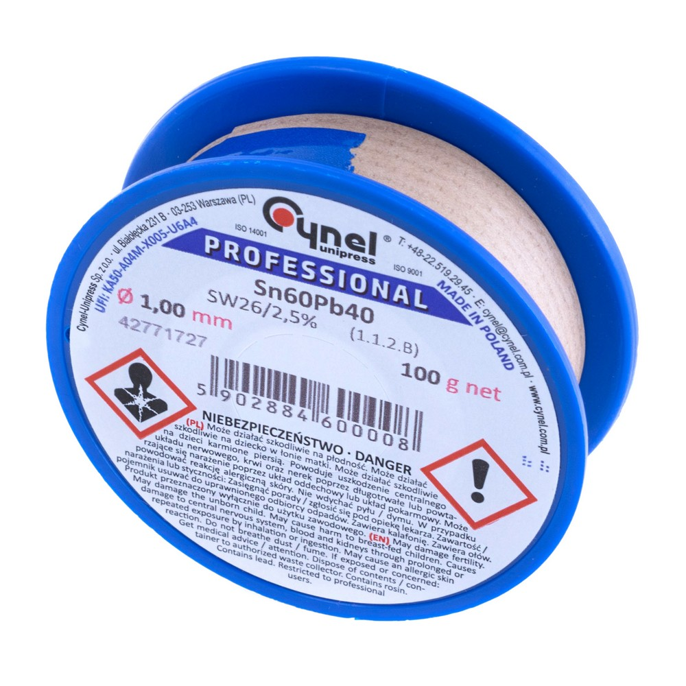

# Solder CYNEL Sn60Pb40-SW26/2.5% 1.0mm - Solder Wire

## Overview

**CYNEL Sn60Pb40-SW26/2.5% 1.0mm solder** is a leaded solder wire used to make electrical and mechanical connections between components and PCB pads.

It melts at a lower temperature than lead-free solder, which makes it easier for students to learn soldering.

In this course it is used for:

- Pin headers
- Through-hole components
- Wires and connectors
- Basic repair work

---

## Image

---

## Key Specifications

- Type: solder wire with flux core
- Alloy: **Sn60Pb40**
- Tin content: **60%**
- Lead content: **40%**
- Flux type: **SW26**
- Flux content: **2.5%**
- Diameter: **1.0mm**
- Typical soldering temperature: **300 - 350 degrees C**

⚠ This solder contains lead. Use ventilation, avoid eating during soldering, and **wash hands with soap** after use.

---

## What It Is Used For

Solder is used to create a conductive joint between metal surfaces.

Typical tasks:

- Connecting header pins to modules
- Joining wires
- Repairing broken solder joints
- Tinning wire ends
- Adding solder to pads before assembly

---

## How to Use

1. Heat the pad and component lead with the soldering iron.
2. Feed solder into the heated joint.
3. Use only enough solder to cover the pad and lead.
4. Remove the solder wire first.
5. Remove the iron second.
6. Hold the joint still until it cools.

The solder should flow around the metal surfaces. It should not sit as a round ball on top of the pad.

---

## Important Notes / Safety

- Contains lead; wash hands after handling.
- Use fume extraction or ventilation.
- Do not touch solder wire to your face or food.
- Do not use excessive solder.
- Keep solder wire clean and dry.
- Avoid breathing fumes from flux.
- Store solder away from heat and contamination.

---

## Typical Use in This Course

- Soldering headers to boards
- Fixing poor solder joints
- Practicing correct solder amount

---

## Common Student Mistakes

- Adding too much solder
- Melting solder on the iron tip only
- Not heating both the pad and pin
- Creating solder bridges between nearby pins
- Moving the joint while it cools
- Forgetting that leaded solder requires hygiene precautions

---

## Advantages

- Easier to use than lead-free solder
- Good wetting on clean pads
- Lower working temperature
- Built-in flux helps solder flow
- Suitable for beginner soldering practice

---

## Limitations

- Contains lead
- Not suitable for lead-free production requirements
- Flux fumes require ventilation
- 1.0mm diameter can be too thick for very fine SMD work
- Still needs extra flux for difficult joints

---

## Summary

CYNEL Sn60Pb40 solder is used to create reliable electrical joints:

- Heat the joint before feeding solder
- Use a controlled amount
- Keep the solder and surfaces clean
- Work with ventilation
- Wash hands after using leaded solder
