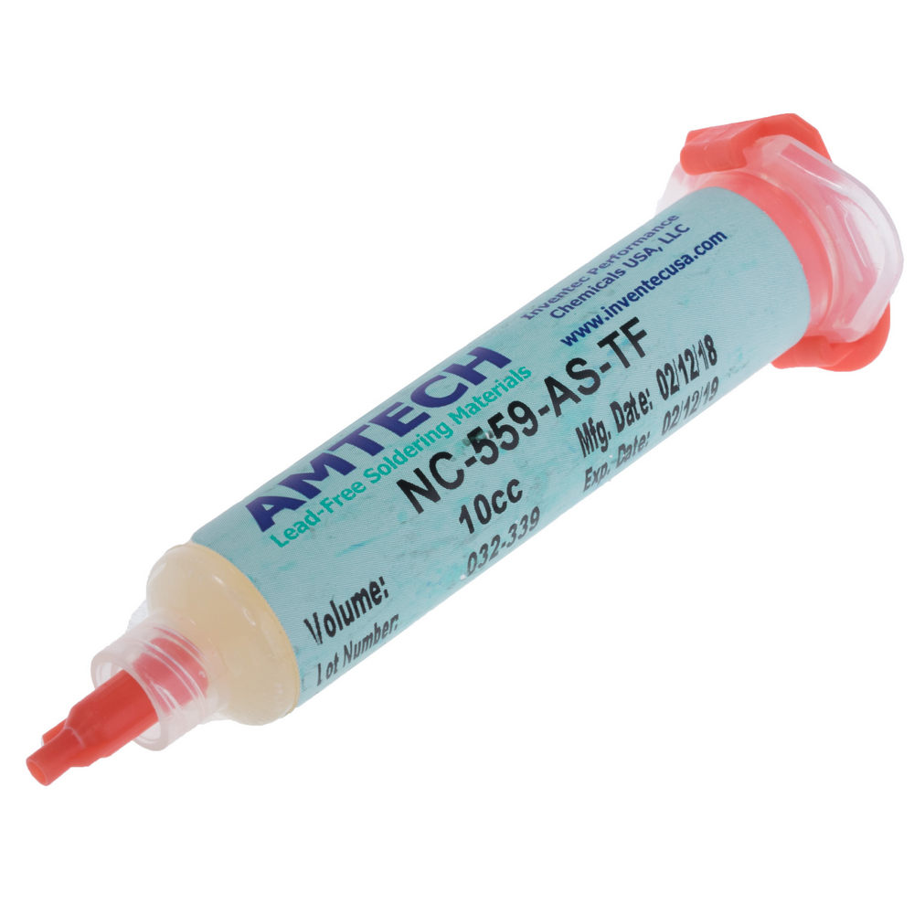

# Soldering Flux NC559 - Soldering Aid

## Overview

**NC559 soldering flux** is a paste-like material used to help solder flow onto metal surfaces.

Flux improves soldering by cleaning oxidation and improving wetting. It is especially useful for connectors, pin headers, and repair work.

In this course it is used to:

- Improve solder flow
- Fix dull or weak solder joints
- Remove solder bridges
- Practice repair techniques

---

## Image

---

## Key Specifications

- Type: soldering flux paste
- Common marking: **NC559**
- Use: electronics soldering and rework
- Application: syringe, needle, brush, or small tool
- Cleaning: depends on exact formulation and lab requirement
- Main benefit: improves solder wetting

---

## What It Is Used For

Flux is used when solder does not flow cleanly.

Typical tasks:

- Reworking pin headers
- Fixing solder bridges
- Soldering oxidized pads
- Improving solder wick performance
- Drag soldering with a K tip

---

## How to Use

1. Apply a small amount of flux to the joint or pins.
2. Heat the joint with the soldering iron.
3. Add solder only if needed.
4. Let the solder flow across the metal surfaces.
5. Remove excess solder with wick if needed.
6. Clean residue if required by the project or lab instructions.

⚠ Use a small amount. Too much flux makes the board messy and harder to inspect.

---

## Important Notes / Safety

- Use ventilation when heating flux.
- Avoid skin and eye contact.
- Do not inhale fumes.
- Keep flux away from connectors where residue can trap dirt.
- Do not use plumbing flux for electronics.
- Close the container after use.
- Clean the board when residue affects inspection or reliability.

---

## Typical Use in This Course

- Improving beginner solder joints
- Repairing solder bridges
- Helping solder wick remove excess solder
- Soldering headers onto modules
- Practicing rework on training boards

---

## Common Student Mistakes

- Using too much flux
- Using plumbing flux instead of electronics flux
- Forgetting ventilation
- Leaving sticky residue everywhere
- Trying to solve every problem by adding more solder instead of adding flux
- Touching flux-covered areas and contaminating the board

---

## Advantages

- Makes solder flow more easily
- Helps repair poor joints
- Useful for fine-pitch pins
- Reduces heating time when used correctly
- Improves solder wick performance

---

## Limitations

- Creates residue
- Fumes require ventilation
- Does not fix dirty, damaged, or lifted pads by itself
- Too much flux can hide solder bridges
- Exact cleaning requirement depends on the product formulation

---

## Summary

NC559 flux is a practical soldering aid:

- Use it to improve wetting and repair joints
- Apply only a small amount
- Use ventilation
- Clean residue when needed
- Never replace electronics flux with aggressive plumbing flux
