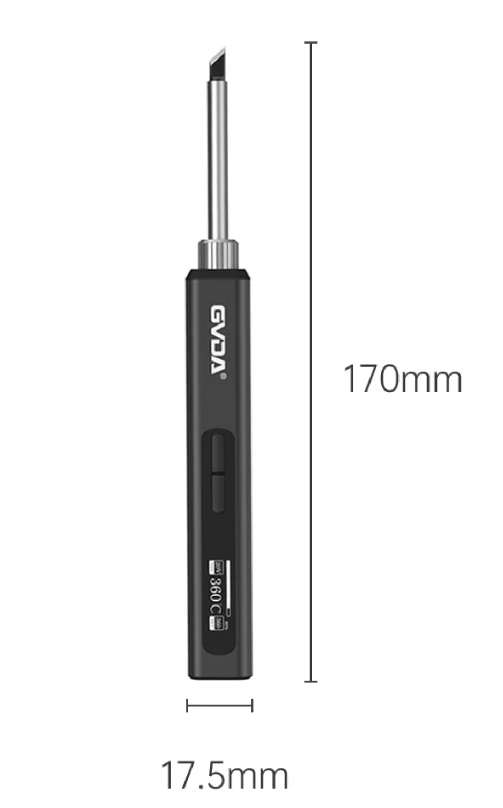
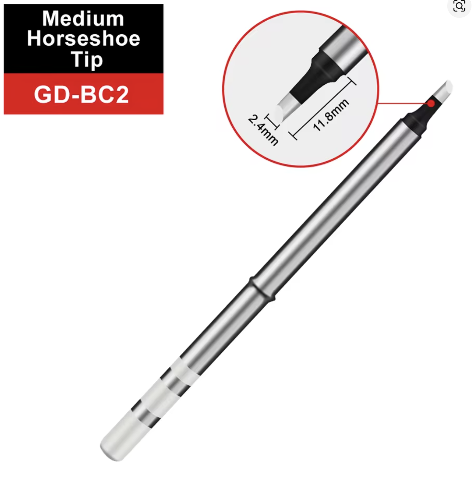
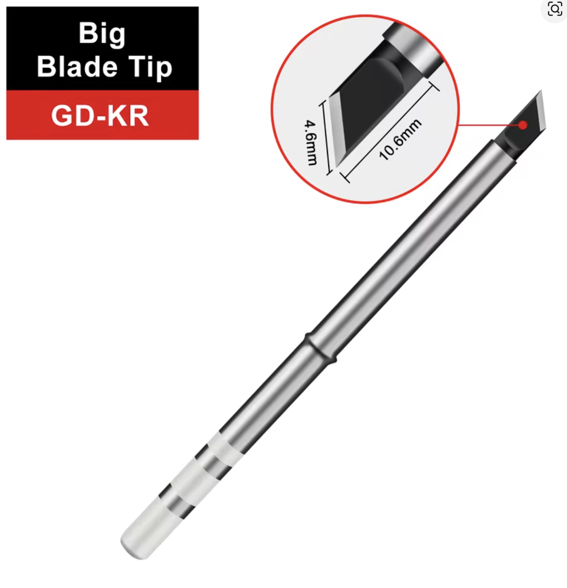

# Soldering Iron GVDA GD300 Type-C 65W - Lab Soldering Tool

## Overview

The **GVDA GD300 Type-C 65W soldering iron** is a temperature-controlled tool used to join electronic components with solder.

In embedded development it is used for:

- Soldering pin headers
- Repairing wires and connectors
- Assembling small modules
- Practicing reliable electrical joints

⚠ This tool gets very hot. Treat it as a precision heating tool, not as a general workshop tool.

---

## Image

---

## Key Specifications

- Model: **GVDA GD300**
- Power: **65W**
- Power input: **USB Type-C PD**
- Temperature control: adjustable
- Typical soldering temperature: **300 - 350 degrees C**
- Tip types used in this course:
    - **BC-2**
    - **K**
- Main use: electronics soldering and repair

---

## What It Is Used For

The soldering iron is used to heat a pad, pin, or wire until solder can flow and create a solid electrical connection.

Common lab tasks:

- Solder headers to ESP32-S3 or STM32 modules
- Attach wires to sensors or connectors
- Repair weak solder joints
- Tin wire ends before connecting them
- Remove solder bridges with wick and flux

---

## How to Use

1. Place the iron in a stable stand.
2. Connect a suitable USB-C PD power supply.
3. Set the temperature to about **320 degrees C** for normal Sn60Pb40 solder.
4. Wait until the tip reaches temperature.
5. Clean the tip on a cellulose or metal sponge.
6. Add a small amount of fresh solder to the tip.
7. Heat both the pad and component lead.
8. Feed solder into the joint, not only onto the iron tip.
9. Remove the solder first, then remove the iron.
10. Let the joint cool without movement.

Good solder joints are shiny, smooth, and shaped like a small cone or fillet.

---

## Tip Selection

### BC-2 Tip

The **BC-2** tip is useful for:

- Pin headers
- Through-hole components
- Medium pads
- General lab soldering

⚠ It transfers heat well because the contact area is larger than a very sharp conical tip.

### K Tip

The **K** tip is useful for:

- Drag soldering
- Cleaning solder bridges
- Larger pads
- Work where more heat transfer is needed

⚠ Use it carefully around small SMD parts because it can heat nearby pads quickly.

---

## Important Notes / Safety

- The tip can exceed **350 degrees C** and can burn skin immediately.
- Always return the iron to its stand when not in use.
- Do not touch the metal tip or heater area.
- Keep the cable away from the hot tip.
- Use ventilation when soldering.
- Do not leave the iron powered unattended.
- Do not scrape the tip aggressively; it can damage the plating.
- Keep the tip lightly tinned when storing the iron.
- ⚠ Wash hands with soap after soldering, especially when using leaded solder.

---

## Typical Use in This Course

- Soldering pin headers to modules
- Preparing jumper wires
- Repairing loose connections
- Practicing clean solder joints
- Learning basic PCB handling

---

## Common Student Mistakes

- Using too low temperature and heating the joint for too long
- Using too high temperature and damaging pads
- Melting solder only on the tip instead of heating the joint
- Forgetting to clean and tin the tip
- Pressing hard on pads
- Moving the joint before solder solidifies
- Leaving the iron on the table instead of in the stand

---

## Advantages

- Portable USB-C powered tool
- Adjustable temperature
- Enough power for typical course soldering
- Works with different tip shapes
- Good for both assembly and repair

---

## Limitations

- Needs a suitable USB-C PD power supply
- Not ideal for large thermal masses
- Tip care is required
- Can damage components if used incorrectly
- Requires ventilation and safe handling

---

## Summary

The GVDA GD300 soldering iron is the main soldering tool for the lab:

- Use about 300 - 350 degrees C for normal soldering
- Choose BC-2 for general work and K for wider heat transfer
- Keep the tip clean and tinned
- Heat the joint, not just the solder
- Handle it carefully because the tip is dangerously hot

## Soldering is easy (by Mitch Altman)

- English [https://mightyohm.com/files/soldercomic/FullSolderComic_EN.pdf](https://mightyohm.com/files/soldercomic/FullSolderComic_EN.pdf)
- Ukrainian [https://mightyohm.com/files/soldercomic/translations/FullSolderComic_UA.pdf](https://mightyohm.com/files/soldercomic/translations/FullSolderComic_UA.pdf)
