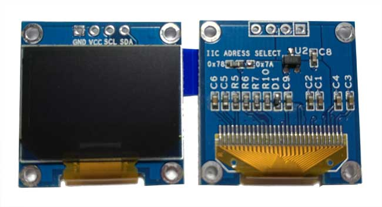

# SSD1306 – 128×64 OLED Display (I2C)

## Overview

The SSD1306 is a monochrome OLED display controller commonly used with 128×64 pixel displays.

In this course it is used to practice:
- I2C communication
- Display buffer handling
- Text and graphics rendering
- Real-time UI updates

---

## Image

---

## Key Specifications

- Resolution: **128 × 64 pixels**
- Interface: **I2C** (most common version)
- Supply voltage: **3.3V – 5V** (depends on breakout board)
- I2C address: **0x3C or 0x3D**
- Monochrome (1-bit per pixel)

⚠ The controller core is 3.3V. Many modules include level shifting.

---

## Pinout (Typical I2C Version)

| Pin | Function | Notes |
|------|----------|--------|
| VCC | Power | 3.3V or 5V (check module) |
| GND | Ground | Common ground required |
| SDA | I2C Data | Connect to MCU SDA |
| SCL | I2C Clock | Connect to MCU SCL |

⚠ Use pull-up resistors (2k2 - 4.7k - 10kΩ) if not present on module.

---

## Electrical Notes

- Always verify module voltage support.
- I2C address depends on board wiring (usually 0x3C).
- Requires display initialization sequence before use.
- Uses internal display RAM buffer (1 KB).

---

## Common Student Mistakes

- Wrong I2C address (0x3C vs 0x3D)
- Forgetting to call display update function
- No common ground
- Insufficient power supply stability
- Trying to write pixels without clearing buffer

---

## Datasheet

SSD1306 Controller Datasheet:
[https://cdn-shop.adafruit.com/datasheets/SSD1306.pdf](https://cdn-shop.adafruit.com/datasheets/SSD1306.pdf)

---

## Example Usage

- Initialize display via I2C
- Create framebuffer in RAM
- Draw text or graphics
- Send buffer to display
- Update screen periodically (non-blocking)

Typical use in this course:
- Display time from RTC
- Show BME280 measurements
- Show encoder values
- Create simple UI
