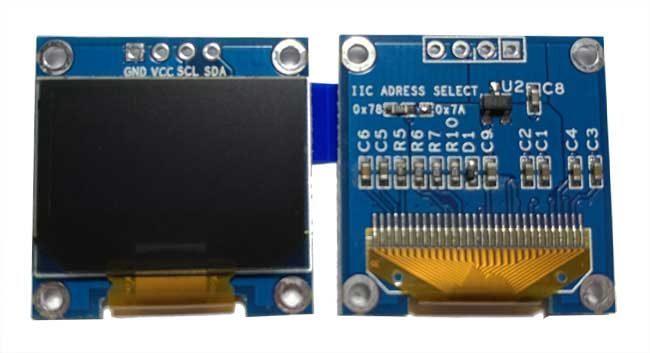
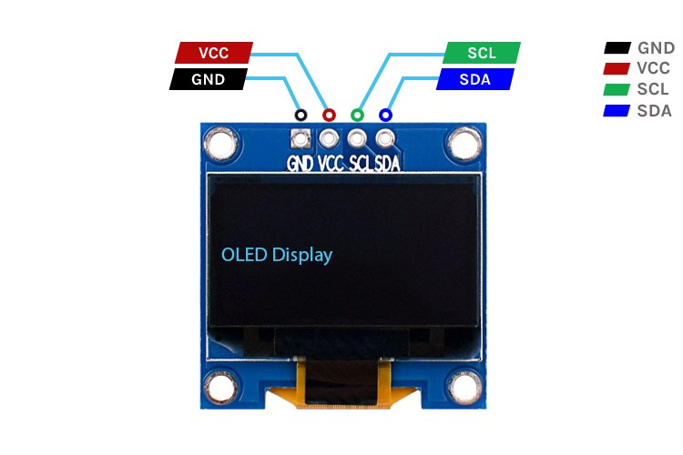

# SSD1306 - 128x64 OLED Display (I2C)

## Overview

The **SSD1306** is a monochrome OLED display controller commonly used with small 128x64 pixel displays.

It is one of the most useful output modules in beginner embedded projects because it can show text, numbers, menus, and simple graphics.

In this course it is used to practice:

- I2C communication
- Display initialization
- Framebuffer usage
- Text and graphics rendering
- Real-time UI updates
- Debug output without a computer terminal

---

## Image

---

## Key Specifications

- Display type: monochrome OLED
- Common resolution: **128 x 64 pixels**
- Interface: usually **I2C**
- Supply voltage: often **3.3V - 5V**, depending on breakout board
- Logic level: usually **3.3V** for ESP32-S3 and STM32F411 projects
- I2C address: usually **0x3C** or **0x3D**
- Pixel format: **1 bit per pixel**
- Display RAM for 128x64: **1024 bytes**

⚠ The SSD1306 controller core is a 3.3V device. Some modules include regulators or level shifting, but not all modules do.

---

## How It Works

The SSD1306 controller stores the screen image in internal display memory.

The MCU usually works like this:

- Create or update a framebuffer in MCU RAM
- Draw text, pixels, lines, or shapes into the framebuffer
- Send the framebuffer to the display over I2C
- The OLED keeps showing the last received image

Changing a variable in firmware does not automatically update the display. The updated buffer must be sent to the display.

---

## Basic Circuit / Connection

Typical I2C wiring:

| SSD1306 Pin | ESP32-S3 / STM32F411 Connection | Notes |
|-------------|----------------------------------|-------|
| VCC | 3.3V or module-supported supply | Check your breakout board |
| GND | GND | Common ground required |
| SDA | I2C SDA | Data line |
| SCL | I2C SCL | Clock line |

⚠ Most small SSD1306 modules use only four pins.

---

## Important Electrical Notes

- Use 3.3V logic with ESP32-S3 and STM32F411.
- Do not connect SDA or SCL to 5V pull-ups unless the board is 5V tolerant.
- I2C requires pull-up resistors on SDA and SCL.
- Many SSD1306 breakout boards already include pull-up resistors.
- Typical I2C pull-up values are **2.2k ohm - 10k ohm**.
- Always connect common ground between the display and MCU.
- Keep I2C wires short during breadboard work.
- OLED displays can suffer burn-in if the same bright image is shown for a very long time.

---

## Basic Calculations

### Framebuffer Size

A 128x64 monochrome display has:

\[
128 \cdot 64 = 8192 \text{ pixels}
\]

Because each pixel uses 1 bit:

\[
\frac{8192}{8} = 1024 \text{ bytes}
\]

So a full framebuffer needs about **1 KB of RAM**.

### I2C Pull-up Current

When an I2C line is pulled LOW:

\[
I = \frac{V}{R}
\]

Example with 3.3V and 4.7k ohm:

\[
I = \frac{3.3}{4700} \approx 0.7mA
\]

This is safe for typical MCU I2C pins.

---

## Typical Use in This Course

- Show sensor values from BME280 or DS18B20
- Display time from DS1307 RTC
- Show rotary encoder menu values
- Print debugging information without using UART
- Create simple user interfaces
- Practice periodic non-blocking display updates

---

## Common Student Mistakes

- Using the wrong I2C address
- Swapping SDA and SCL
- Forgetting common ground
- Forgetting to send the framebuffer after drawing
- Clearing the buffer after drawing but before updating the display
- Using 5V I2C pull-ups with 3.3V GPIO pins
- Updating the display too often and slowing down the main loop
- Expecting text to appear without selecting a font or cursor position in the library

---

## Advantages

- Clear and readable display
- Uses only two I2C signal wires
- Good for menus and debugging
- Low power compared with many backlit LCDs
- Widely supported by embedded libraries

---

## Limitations

- Monochrome only
- Small screen area
- Requires framebuffer memory
- I2C updates are slower than SPI updates
- Burn-in is possible with static images
- Not ideal for large or fast animations

---

## Datasheet

SSD1306 controller datasheet:

[https://cdn-shop.adafruit.com/datasheets/SSD1306.pdf](https://cdn-shop.adafruit.com/datasheets/SSD1306.pdf)

---

## Summary

The SSD1306 OLED display is a practical embedded output module:

- Uses I2C in most course projects
- Usually appears at address 0x3C or 0x3D
- Needs correct pull-ups and common ground
- Uses about 1 KB RAM for a 128x64 framebuffer
- Is excellent for showing sensor values, menus, status, and debug information
