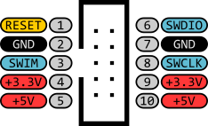

# ST-Link V2 – Debugger / Programmer (clone)

## Overview

The ST-Link V2 is a hardware debugger and programmer used to interface with STM32 microcontrollers.

It allows you to:

- Flash firmware to STM32 devices
- Debug code (breakpoints, stepping, registers)
- Access memory and peripherals in real time

In this course it is used to:
- Program STM32 boards (Black Pill)
- Perform SWD debugging
- Inspect registers and memory
- Practice low-level debugging techniques

---

## Image

---

## Key Specifications

- Interface: USB to SWD
- Supported protocols: SWD (primary), JTAG (limited)
- Target voltage: **3.3V**
- Able to supply power to the target (current limited by USB)
- Compatible with STM32 MCUs
- Supported by STM32CubeIDE, OpenOCD, PlatformIO

⚠ Designed for **3.3V systems**.

---

## Important Electrical Limits

- Target voltage: **3.3V**
- Some versions tolerate 5V on VCC sense, but **do not rely on it**
- Signals (SWDIO, SWCLK) are **3.3V logic**

Always ensure:
- Common ground between ST-Link and target board
- Correct voltage level before connecting

---

## Commonly Used Connections

| ST-Link Pin | STM32 (Black Pill) | Function |
|-------------|--------------------|----------|
| SWDIO       | PA13               | Data line |
| SWCLK       | PA14               | Clock line |
| GND         | GND                | Ground |
| 3.3V        | 3.3V               | Target reference (optional) |

---

## Pinout

SWD connector properties:
Type: IDC (2.54mm, 5x2, male)

Pinout:
| #   | Name        | Internally connected to |
|-----|-------------|--------------|
| 1   | RST         | PB6          |
| 2   | SWDIO       | PB12         |
| 3   | GND         | Ground plane |
| 4   | GND         | Ground plane |
| 5   | SWIM        | PB11         |
| 6   | SWCLK       | PA5          |
| 7   | 3.3V        | +3.3V rail   |
| 8   | 3.3V        | +3.3V rail   |
| 9   | 5.0V        | +5V rail     |
| 10  | 5.0V        | +5V rail     |

---

## Important Notes

- ST-Link uses **SWD (Serial Wire Debug)** protocol
- Only 2 signal lines are required (SWDIO + SWCLK)
- Reset pin (NRST) is optional but **recommended**

Optional connection:

- NRST → RESET (for better flashing reliability)

---

## Power Considerations

- ST-Link can provide **3.3V output** (limited current)
- Recommended to power target board separately

⚠ Do not power high-load circuits from ST-Link.

---

## Typical Workflow

1. Connect ST-Link to PC via USB
2. Connect SWDIO, SWCLK, GND (and optionally 3.3V, NRST)
3. Open development environment (PlatformIO / STM32CubeIDE)
4. Flash firmware
5. Start debugging session

---

## Common Student Mistakes

- Not connecting GND
- Swapping SWDIO and SWCLK
- Powering board incorrectly
- Using 5V logic accidentally
- Forgetting to select correct debug probe
- Overwriting SWD pins in firmware

---

## Typical Use in This Course

- Flashing STM32 firmware
- Step-by-step debugging
- Inspecting registers and memory
- Verifying peripheral configuration
- Debugging interrupts and timing issues

---

## Documentation

Official documentation:

- https://www.st.com/en/development-tools/st-link-v2.html

OpenOCD (used in PlatformIO):

- https://openocd.org/

Useful links:

- brief information: https://stm32-base.org/boards/Debugger-STM32F101C8T6-STLINKV2
- connecting guide: https://stm32-base.org/guides/connecting-your-debugger.html

---

## Summary

The ST-Link V2 is an essential tool for STM32 development, enabling:

- Reliable firmware flashing
- Real-time debugging
- Deep visibility into MCU behavior
