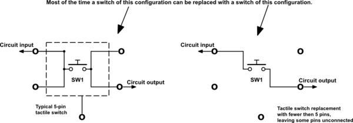
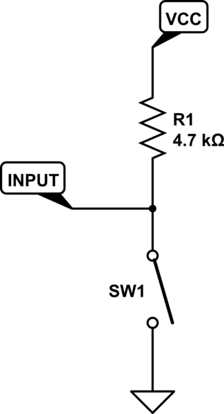
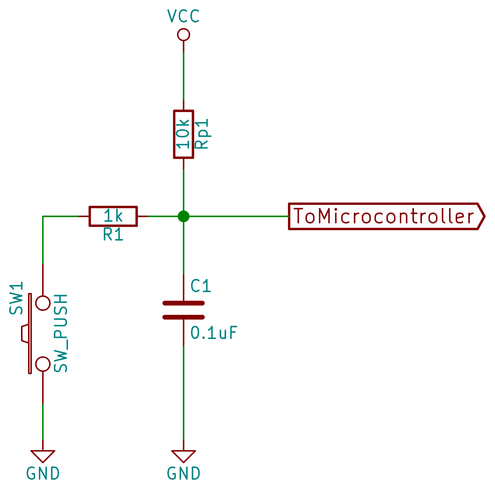
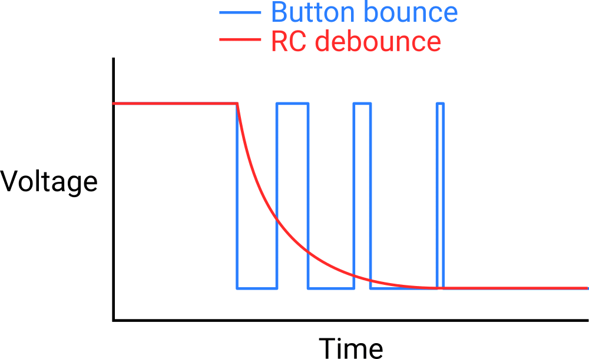

# Tact Switch – Digital Input Component

## Overview

A **tact switch** (tactile push button) is a momentary mechanical switch used for user input.

It allows the user to **open or close a circuit** by pressing it.

In this course it is used to:

- Read digital input (pressed / not pressed)
- Trigger events (interrupts)
- Practice debouncing
- Build simple user interfaces

---

## Image


---

## Key Specifications

- Type: Momentary push button
- Operation: Normally Open (NO)
- States:
    - Not pressed → open circuit
    - Pressed → closed circuit
- No polarity

---

## How It Works

Internally, the tact switch connects two pairs of pins:



- Pins (1–2) are connected
- Pins (3–4) are connected
- Pressing the button connects both sides together

---

## Basic Circuit (Pull-up)



### Behavior

- Not pressed → GPIO = HIGH
- Pressed → GPIO = LOW

---

## Why Pull Resistor is Required

Without resistor:

- Input pin is **floating**
- Random values (noise)
- Unstable behavior

Typical value:

- **10kΩ**

---

## Button Bounce (Very Important)

Mechanical switches do not produce clean signals.

Instead of:

```
LOW ──────── HIGH
```

You get:

```
LOW ──▁▔▁▔▁▔── HIGH
```

---

## Debouncing Methods

### 1. Software Debounce

- Wait after first press (e.g., 20–50 ms)
- Ignore rapid changes

---

### 2. Hardware Debounce (RC Filter)





- R = 10kΩ
- C = 100nF

---

## Typical Use in This Course

- Button-controlled LED
- Menu navigation
- Interrupt-based input
- State machines

---

## Common Student Mistakes

- No pull-up/down resistor
- Wrong wiring (diagonal pins)
- Ignoring bounce → multiple triggers
- Expecting stable signal without filtering

---

## Advantages

- Simple and cheap
- Reliable user input
- Easy to interface with MCU

---

## Limitations

- Mechanical wear
- Requires debouncing
- Limited to on/off input

---

## Summary

The tact switch is a basic input component:

- Converts user press → digital signal
- Requires pull resistor
- Needs debouncing for reliable operation

Essential for learning:

- GPIO input
- Interrupts
- Signal conditioning
