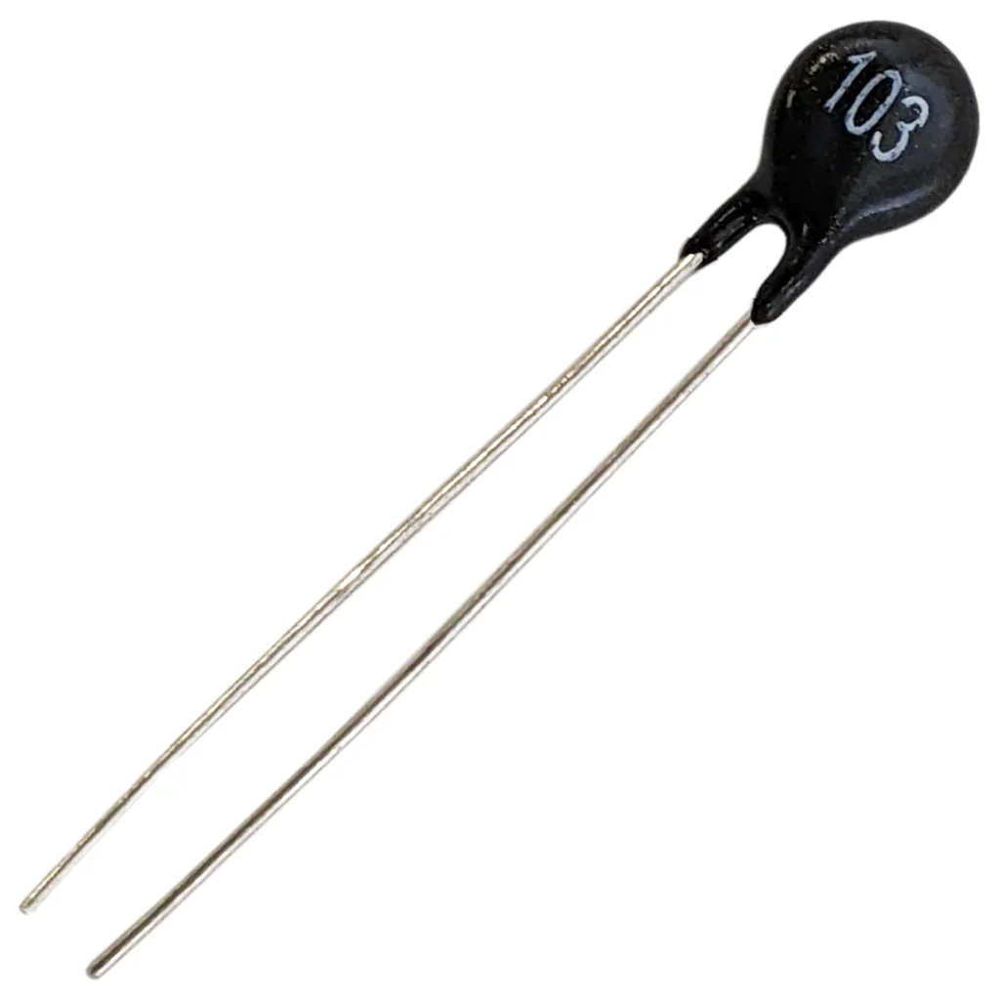
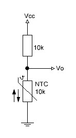

# NTC Thermistor (10kΩ) – Temperature Sensor

## Overview

An **NTC thermistor** (Negative Temperature Coefficient) is a resistor whose resistance **decreases as temperature increases**.

It is a simple and widely used analog temperature sensor.

In this course it is used to:
- Measure temperature using ADC
- Practice voltage dividers
- Work with analog signals
- Implement calibration and conversion to °C

---

## Image

---

## Key Specifications

- Type: NTC (Negative Temperature Coefficient)
- Nominal resistance: **10kΩ @ 25°C**
- Behavior: Resistance **DOWN** when temperature **UP**
- Typical range: **-40°C to +125°C**

---

## How It Works

- At low temperature → **high resistance**
- At high temperature → **low resistance**

Example (approximate values):

| Temperature | Resistance |
|------------|-----------|
| 0°C        | ~30kΩ     |
| 25°C       | **10kΩ**  |
| 50°C       | ~3.5kΩ    |
| 80°C       | ~1kΩ      |

---

## Basic Circuit (Voltage Divider)

NTC is used with a resistor to convert resistance change to voltage change (voltage divider):

---

## Voltage Calculation

\[
V_{out} = V_{cc} \cdot \frac{R_{NTC}}{R_{fixed} + R_{NTC}}
\]

As temperature increases:
- \(R_{NTC}\) decreases
- \(V_{out}\) decreases

---

## Converting ADC Voltage to Temperature

The NTC thermistor has a **non-linear (exponential)** relationship between temperature and resistance.

To get temperature from ADC readings, follow steps:

### Step 1: ADC → Voltage

\[
V = \frac{ADC}{ADC_{max}} \cdot V_{ref}
\]

---

### Step 2: Voltage → Resistance

From voltage divider:

\[
R_{NTC} = R_{fixed} \cdot \frac{V}{V_{ref} - V}
\]

---

## Methods of Conversion to Temperature

### 1. Lookup Table (Recommended for Beginners)

- Precompute table: **Resistance → Temperature**
- Use interpolation between points

Example:

| Resistance | Temperature |
|-----------|------------|
| 30kΩ      | 0°C        |
| 10kΩ      | 25°C       |
| 3.5kΩ     | 50°C       |

Pros:
- Simple
- Fast
- Easy to debug

Cons:
- Uses memory
- Limited precision unless table is dense

---

### 2. Beta (β) Equation (Good Balance)

\[
T = \frac{1}{\frac{1}{T_0} + \frac{1}{B} \ln\left(\frac{R}{R_0}\right)}
\]

Where:
- \(T\) = temperature (Kelvin)
- \(T_0\) = reference temperature (usually 298.15K = 25°C)
- \(R_0\) = resistance at \(T_0\) (10kΩ)
- \(B\) = Beta constant (typically ~3950)
- \(R\) = measured resistance

Convert to Celsius:

\[
T_{°C} = T - 273.15
\]

Pros:
- Good accuracy
- No lookup table needed

Cons:
- Requires `log()` function
- Slightly heavier computation

---

### 3. Steinhart–Hart Equation (Most Accurate)

\[
\frac{1}{T} = A + B \ln(R) + C (\ln(R))^3
\]

Where:
- A, B, C = coefficients from datasheet
- T in Kelvin

Pros:
- Very high accuracy
- Works over wide temperature range

Cons:
- More complex
- Requires calibration data

---

## Practical Recommendation for This Course

| Method | When to Use |
|--------|------------|
| Lookup Table | Beginners, fast implementation |
| Beta Equation | Default choice |
| Steinhart–Hart | Advanced students |

---

## Common Mistakes

- Using °C instead of Kelvin in formulas
- Wrong Beta value
- Not matching R₀ and T₀
- Ignoring ADC reference voltage
- Not handling division by zero (V ≈ Vref)

---

## Summary

Because NTC is exponential:

- You **cannot use linear formulas**
- You must convert:
  **ADC → Voltage → Resistance → Temperature**

Recommended approach:
- Start with lookup table
- Move to Beta equation for better accuracy

---

## Why 10kΩ is Used in This Course

### 1. Matches MCU ADC Range

Using:
- NTC = **10kΩ @ 25°C**
- Fixed resistor = **10kΩ**

At room temperature:

\[
V_{out} = \frac{Vcc}{2}
\]

→ Perfectly centered in ADC range
→ Maximum sensitivity around room temperature

---

### 2. Good Trade-off (Noise vs Power)

Compare with other values:

| Value | Pros | Cons |
|------|------|------|
| 1kΩ  | Low noise | High current, wastes power |
| 10kΩ | Balanced | — |
| 100kΩ | Low power | High noise, unstable readings |

---

### 3. Works Well with Available Resistors

- 10kΩ resistors are standard in kits
- Easy voltage divider pairing

---

### 4. Safe Current Levels

At 3.3V:

\[
I = \frac{3.3V}{10k + 10k} = 0.165\ \text{mA}
\]

→ Very low power consumption
→ Safe for continuous measurement

---

## Power Dissipation

\[
P = \frac{V^2}{R}
\]

Example:

\[
P = \frac{3.3^2}{10k} \approx 1.1\ \text{mW}
\]

→ Extremely low → no heating effect

---

## Important Notes

- NTC is **not linear**
- Requires conversion (table or formula)
- Often used with:
  - Lookup tables
  - Steinhart–Hart equation (advanced)

---

## Typical Use in This Course

- Reading temperature via ADC
- Converting voltage → resistance → temperature
- Displaying temperature (OLED)
- Publishing data via MQTT

---

## Common Student Mistakes

- Using wrong resistor value in divider
- Expecting linear behavior
- Forgetting ADC scaling
- Mixing up NTC and PTC
- Poor wiring → unstable readings

---

## Advantages

- Very cheap
- Easy to use
- High sensitivity

---

## Limitations

- Non-linear response
- Requires calibration

---

## Summary

The 10kΩ NTC thermistor is ideal for learning:

- Analog measurement with ADC
- Voltage divider principles
- Sensor calibration

It provides the best balance between:
- Sensitivity
- Stability
- Power consumption
