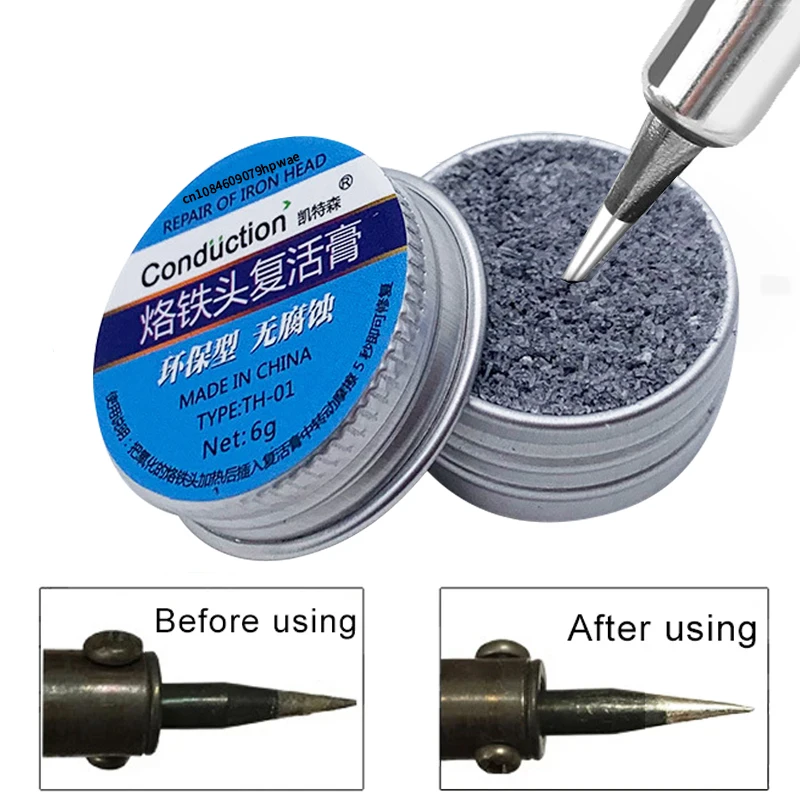

# Chemicals for Tip Cleaning - Soldering Maintenance Materials

## Overview

**Tip cleaning chemicals** are used to maintain soldering iron tips and improve soldering quality when normal wiping is not enough.

They are not a substitute for good soldering technique. They are maintenance materials used carefully and only when needed.

In this course they are used to:

- Improve tip cleaning
- Help remove oxidation
- Support soldering practice
- Keep tools reliable during lab sessions

---

## Image

---

## Key Specifications

- Type: soldering maintenance chemicals
- Common examples:
    - Flux F5
    - Tip tinner / tip activator
- Main use: cleaning, restoring, or maintaining soldering tools
- Application: small amount only
- Safety requirement: ventilation and careful handling

---

## What It Is Used For

Tip cleaning chemicals are used for specific maintenance tasks:

- **Flux F5**: recommended chemical for cleaning support in this lab
- **Tip tinner**: helps restore a tip that no longer wets properly

⚠ Use the mildest method that works. Start with normal sponge cleaning before using stronger chemicals.

---

## How to Use

General workflow:

1. Clean the tip with a cellulose or metal sponge.
2. Check if solder wets the tip.
3. If wetting is poor, apply the recommended chemical carefully.
4. Wipe the tip again.
5. Add fresh solder to tin the tip.
6. Let the tool return to stable temperature.

---

## Important Notes / Safety

- Use ventilation.
- Keep chemicals away from flames and hot surfaces unless specifically intended for hot-tip use.
- Avoid skin and eye contact.
- Do not mix chemicals.
- Do not apply board-cleaning chemicals to powered circuits.
- Read the label or safety data sheet before use.
- Store bottles closed and labeled.
- Use only small amounts.

---

## Typical Use in This Course

- Restoring a soldering tip that does not accept solder

---

## Common Student Mistakes

- Using chemicals before trying basic cleaning
- Applying too much
- Leaving residue under connectors
- Not re-tinning the tip after cleaning
- Using unknown chemicals from outside the lab
- Ignoring ventilation

---

## Advantages

- Helps restore poor tip wetting
- Improves tool maintenance
- Can make difficult soldering easier
- Extends useful tip life when used correctly

---

## Limitations

- Requires careful handling
- Can create fumes
- Does not fix physically damaged tips
- Wrong chemicals can damage boards or tools
- Overuse can make the workspace messy or unsafe

---

## Summary

Tip cleaning chemicals are support materials for soldering:

- Use normal cleaning first
- Use Flux F5 when recommended by the lab
- Use tip tinner only when the tip needs restoration
- Re-tin the soldering tip after chemical cleaning
