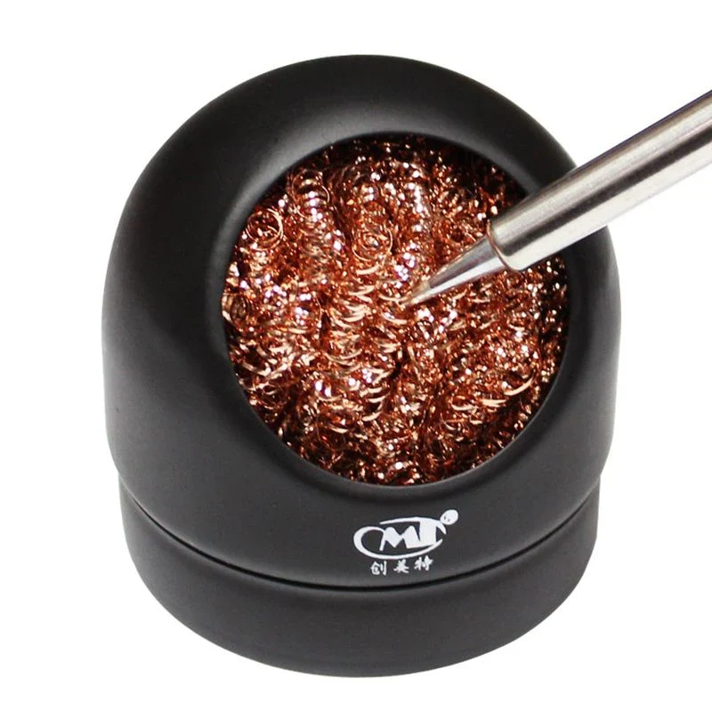

# Metal Wire Sponge - Soldering Tip Cleaning Tool

## Overview

A **metal wire sponge** is used to clean a soldering iron tip without cooling it as much as a damp sponge.

It is usually made from brass or similar soft metal wire.

In this course it is used to:

- Remove excess solder from the tip
- Clean flux residue during soldering
- Maintain tip temperature
- Support longer soldering sessions

---

## Image

---

## Key Specifications

- Type: dry soldering tip cleaner
- Material: usually brass wire
- Use: removing solder and residue from hot tips
- Water required: no
- Main benefit: less thermal shock than a damp sponge

---

## What It Is Used For

The metal wire sponge is used when the tip needs quick cleaning during soldering.

It is good for:

- Removing excess solder
- Cleaning between joints
- Keeping the tip hot
- Avoiding repeated temperature drops

---

## How to Use

1. Keep the metal sponge in a stable holder.
2. Heat the soldering iron.
3. Insert the tip gently into the wire sponge.
4. Twist or wipe lightly.
5. Remove the tip.
6. Add fresh solder to keep the tip tinned.

⚠ Do not push hard. The goal is to wipe the tip, not grind it.

---

## Important Notes / Safety

- Use brass-style tip cleaners, not hard steel wool.
- Do not scrape aggressively.
- Keep the holder stable so it does not move while cleaning.
- Small solder particles can remain in the sponge.
- Do not touch the sponge during soldering; it can become hot.
- Replace the sponge when it becomes contaminated or compacted.

---

## Typical Use in This Course

- Cleaning the tip between solder joints
- Maintaining temperature while soldering pin headers
- Removing excess solder before fixing bridges
- Working with BC-2 or K tips during practice

---

## Common Student Mistakes

- Using steel wool that damages the tip
- Pressing too hard
- Cleaning the tip and leaving it dry
- Touching the metal cleaner while it is hot
- Letting solder debris fall onto the work area
- Using the metal cleaner as a replacement for proper tinning

---

## Advantages

- Does not require water
- Reduces thermal shock
- Keeps the tip hotter than a damp sponge
- Fast to use
- Good for repeated soldering work

---

## Limitations

- Does not clean as aggressively as chemical tip cleaner
- Can collect solder debris
- Poor-quality metal cleaners can damage tips
- Still requires tinning after cleaning
- Needs a stable holder

---

## Summary

The metal wire sponge is a dry soldering tip cleaner:

- Use it gently
- Prefer brass-style material
- Tin the tip after cleaning
- Keep the holder stable
- Use it when you want to clean without cooling the tip much or the tip is too dirty
