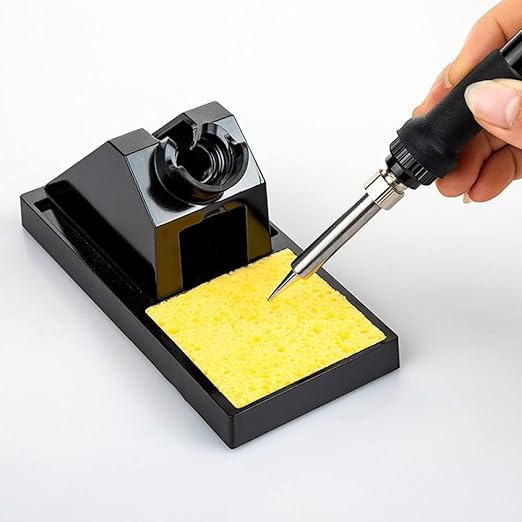

# Cellulose Sponge - Soldering Tip Cleaning Tool

## Overview

A **cellulose sponge** is used to clean oxidation and old solder from a soldering iron tip.

It is a simple tool, but correct tip cleaning makes soldering much easier and protects the iron tip.

In this course it is used to:

- Clean the soldering iron tip during work
- Improve heat transfer
- Remove dirty solder before making a joint
- Teach correct tip maintenance

---

## Image

---

## Key Specifications

- Material: cellulose sponge
- Use: soldering tip cleaning
- Condition during use: slightly damp, not dripping wet
- Recommended cleaning chemical:
    - **Flux F5**,
    - Glycerol,
    - Water
- Main benefit: removes residue quickly

---

## What It Is Used For

The sponge removes:

- Burned flux residue
- Excess solder
- Oxidation from light use
- Contamination before tinning the tip

⚠ It should be used together with proper tinning. A clean but dry tip oxidizes quickly.

---

## How to Use

1. Wet the sponge with clean water or recommended cleaner.
2. Squeeze out excess liquid.
3. Heat the soldering iron.
4. Wipe the tip lightly across the sponge.
5. Add a small amount of fresh solder to the tip.
6. Continue soldering.

⚠ The sponge should be damp enough to clean, but not so wet that it cools the tip too much.

---

## Important Notes / Safety

- Do not use a dry sponge; it can burn.
- Do not soak the sponge; thermal shock can stress the tip.
- Do not press hard on the tip.
- Replace the sponge when it becomes dirty or damaged.
- Use Flux F5 only according to lab instructions.
- Keep cleaning liquids away from powered electronics.

---

## Typical Use in This Course

- Cleaning the iron before soldering headers
- Removing old solder from the tip
- Preparing the tip before tinning
- Maintaining stable heat transfer during practice

---

## Common Student Mistakes

- Using the sponge completely dry
- Leaving it too wet
- Cleaning the tip and not re-tinning it
- Pressing hard and damaging tip plating
- Using dirty sponge material
- Cleaning too often and cooling the tip unnecessarily

---

## Advantages

- Cheap and simple
- Cleans quickly
- Good for beginner soldering
- Helps keep solder joints clean
- Easy to replace

---

## Limitations

- Can cool the tip
- Needs moisture control
- Wears out over time
- Does not restore badly oxidized tips by itself
- Can leave the tip vulnerable if not followed by tinning

---

## Summary

The cellulose sponge is a basic soldering tip cleaner:

- Use it slightly damp
- Wipe gently
- Tin the tip after cleaning
- Replace dirty sponges
- Flux F5 can be used as the recommended cleaning chemical when instructed
