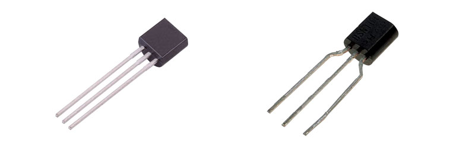
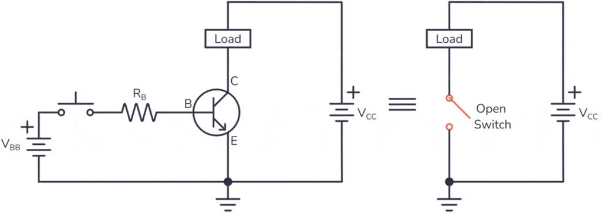

# Transistors (BJT: 2N2222, BC547B, BC557B) – Switching Component

## Overview

A **transistor** is an active component used to **control current**.

In this course, BJTs (Bipolar Junction Transistors) are used mainly as:

- Electronic switches
- Signal amplifiers (basic understanding)

In this course it is used to:

- Control higher current loads (LEDs, motors)
- Interface MCU with external devices
- Learn switching and basic analog behavior

---

## Image

---

## Key Specifications

### NPN Transistors

- **2N2222**
- **BC547B**

### PNP Transistor

- **BC557B**

Typical parameters:

- Max current: **~100–600 mA** (depends on model)
- Gain (β): **~100–300**
- Base-emitter voltage: **~0.7V**

---

## Types

| Type | Behavior |
|------|--------|
| NPN | Turns ON when base is HIGH |
| PNP | Turns ON when base is LOW |

---

## Pinout (Typical)

- **Base (B)** – control input
- **Collector (C)** – current input/output
- **Emitter (E)** – reference (usually GND or VCC)

⚠ Pin order depends on transistor model

---

## How It Works (NPN Example)

- Small current into **base** controls larger current from **collector to emitter**

\[
I_C = \beta \cdot I_B
\]

---

## Basic Switching Circuit (NPN)

---

## Base Resistor Calculation

To safely drive transistor from MCU:

\[
I_B = \frac{I_C}{\beta}
\]

\[
R_B = \frac{V_{GPIO} - 0.7}{I_B}
\]

---

### Example

- Load current: 100 mA
- Gain (β): 100

\[
I_B = 1\ \text{mA}
\]

\[
R_B = \frac{3.3 - 0.7}{0.001} = 2.6kΩ
\]

→ Use **2.2kΩ or 3.3kΩ**

---

## Saturation Mode (Important)

When used as switch:

- Transistor should be **fully ON (saturated)**
- Ensure enough base current

Rule of thumb:
- Use **forced β ≈ 10**

---

## Power Dissipation

\[
P = V_{CE} \cdot I_C
\]

In saturation:
- \(V_{CE} \approx 0.1–0.3V\)

→ Low power loss

---

## PNP Usage (Brief)

- Works opposite of NPN
- Used for **high-side switching**
- Base pulled LOW to turn ON

---

## Typical Use in This Course

- Driving LEDs with higher current
- Controlling motors (with diode protection)
- Interfacing MCU (3.3V) with higher loads
- Learning switching behavior

---

## Common Student Mistakes

- No base resistor → MCU damage
- Wrong pinout → circuit does not work
- Not enough base current → transistor not fully ON
- Forgetting flyback diode (for motors)
- Mixing NPN and PNP logic

---

## Advantages

- Simple and cheap
- Good for learning fundamentals
- Works well as switch

---

## Limitations

- Requires base current
- Less efficient than MOSFET
- Voltage drop when ON

---

# MOSFET (Short Overview)

A **MOSFET** is another type of transistor:

- Voltage-controlled (no base current)
- Higher efficiency
- Lower losses

### Key Differences

| Feature | BJT | MOSFET |
|--------|-----|--------|
| Control | Current | Voltage |
| Efficiency | Lower | Higher |
| Input load | Higher | Very low |
| Use case | Learning, simple switching | Power switching |

### When to Use MOSFET

- Higher current loads
- Efficient switching
- Battery-powered systems

---

## Summary

BJTs are essential switching components:

- Use small current to control larger current
- Require base resistor
- Ideal for learning transistor basics

MOSFETs are a more advanced alternative:
- More efficient
- Better for real-world power applications
