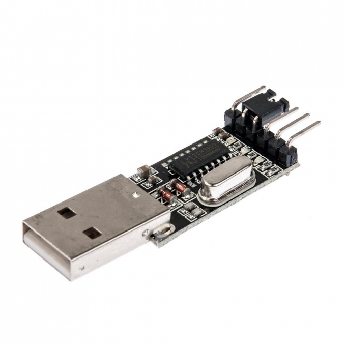
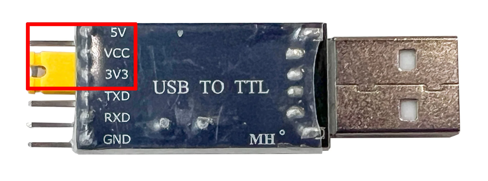
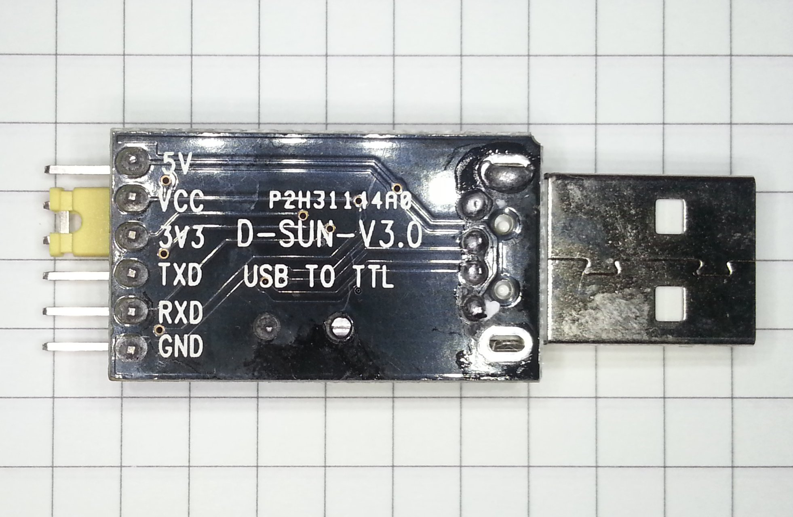
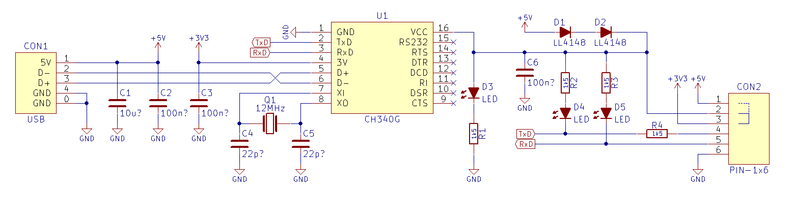

# USB-TTL Serial Adapter (CH340) – Communication Tool

## Overview

The **USB-TTL Serial Adapter based on CH340** is a simple and widely used device for serial communication between a computer and microcontrollers.

It allows you to:

- Send and receive UART data
- Flash firmware (via bootloader)
- Monitor logs and debug output

In this course it is used to:

- Communicate with STM32 and ESP32 boards
- Flash firmware via UART bootloader
- Monitor serial output (printf debugging)

---

## Image



---

## Key Specifications

- Chip: **CH340 (USB to UART bridge)**
- Interface: USB ↔ UART (TTL level)
- Logic levels: **3.3V / 5V** (selectable on some boards)
- Baud rate: up to ~2 Mbps (typical use: 115200)
- Drivers required (depending on OS)

⚠ Ensure correct logic level before connecting.

---

## TTL Level Selection (3.3V / 5V)

Some CH340 adapters include a **jumper or switch** to select logic level:



- **3.3V mode** → for STM32, ESP32, most modern MCUs
- **5V mode** → for Arduino Uno and other 5V systems

⚠ Important:
- Always verify jumper position before connecting
- Using **5V TX on a 3.3V MCU can damage it**

---

## Important Electrical Limits

- Logic level must match target device (**3.3V for STM32 / ESP32**)
- Do not connect 5V TX to 3.3V MCU RX
- Adapter can supply limited current via VCC pin

Always ensure:
- Common ground between adapter and target
- Correct voltage selection (if jumper/switch exists)

---

## Commonly Used Connections

| Adapter Pin | MCU (STM32 / ESP32) | Function |
|------------|----------------------|----------|
| TX         | RX                   | Data (PC → MCU) |
| RX         | TX                   | Data (MCU → PC) |
| GND        | GND                  | Ground |
| VCC (opt.) | 3.3V / 5V            | Power (optional) |

⚠ TX and RX must be **cross-connected**.

---

## Pinout



---

## Schematics



---

## Important Notes

- UART is **asynchronous communication**
- No clock line required
- Both sides must use the same:
    - Baud rate
    - Data bits
    - Parity
    - Stop bits

Typical configuration:
- 115200 baud (for older/slower hardware 9600)
- 8 data bits
- No parity
- 1 stop bit (8N1)

---

## Drivers

Depending on your OS, drivers may be required:

- Windows: CH340 driver installation needed
- Linux: Usually supported out of the box
- macOS: Driver may be required but usually supported out of the box

---

## Typical Workflow

1. Connect TX/RX/GND to MCU
2. Connect adapter to PC via USB
3. Open serial terminal of your choice
4. Select correct COM/TTY port
5. Set baud rate (e.g. 115200, 9600)
6. Start communication

---

## Serial Terminal Setup by OS

### Windows (PuTTY)

**Install PuTTY:**
- Download: https://www.chiark.greenend.org.uk/~sgtatham/putty/latest.html

**Find COM port:**

1. Open **Device Manager**
2. Go to **Ports (COM & LPT)**
3. Find device like: `USB-SERIAL CH340 (COM3)`

**Use PuTTY:**

1. Open PuTTY
2. Select **Serial**
3. Enter:
    - Serial line: `COM3` (example)
    - Speed: `115200`
4. Click **Open**

---

### Ubuntu / Linux

**Find device:**

```bash
ls /dev/ttyUSB*
# or
dmesg | grep tty
```

**Typical device:**

```bash
/dev/ttyUSB0
```

**Install tools:**

- picocom:
```bash
sudo apt install picocom
```
- minicom:
```bash
sudo apt install minicom
```
- screen (usually preinstalled):
```bash
sudo apt install screen
```

**Usage:**

- picocom:
```bash
picocom -b 115200 /dev/ttyUSB0
```
- minicom:
```bash
minicom -D /dev/ttyUSB0 -b 115200
```
- screen:
```bash
screen /dev/ttyUSB0 115200
```

⚠ You may need permissions:
```bash
sudo usermod -aG dialout $USER
```
**(relogin required)**

---

### macOS

**Find device:**

```bash
ls /dev/tty.*
```

**Typical device:**

```bash
/dev/tty.usbserial1001
```

**Install tools (Homebrew required):**

- Install Homebrew (if not installed):
```bash
/bin/bash -c "$(curl -fsSL https://raw.githubusercontent.com/Homebrew/install/HEAD/install.sh)"
```
- picocom:
```bash
brew install picocom
```
- minicom:
```bash
brew install minicom
```
- screen (preinstalled on macOS)

**Usage:**

- picocom:
```bash
picocom -b 115200 /dev/tty.wchusbserialXXXX
```
- minicom:
```bash
minicom -D /dev/tty.wchusbserialXXXX -b 115200
```
- screen:
```bash
screen /dev/tty.wchusbserialXXXX 115200
```

---

## Flashing via UART (STM32)

**For STM32 (e.g., Black Pill):**

⚠ Bootloader needs to support this mode.

1. Set BOOT0 = 1
2. Reset board
3. Use STM32CubeProgrammer
4. After flashing, set BOOT0 = 0 and reset

---

## Common Student Mistakes

- Not crossing TX/RX
- Forgetting GND connection
- Using wrong voltage level (5V vs 3.3V)
- Wrong baud rate
- Selecting wrong COM/TTY port
- No permissions on Linux
- Powering board incorrectly

---

## Typical Use in This Course

- UART debugging (printf logs)
- Communication between ESP32 and STM32
- Flashing STM32 via bootloader
- Testing serial protocols
- Advantages
- Very low cost
- Simple and reliable
- Widely supported
- Essential for UART debugging

---

## Limitations

- No debugging capability (unlike ST-Link)
- No protocol decoding (unlike logic analyzer)
- Manual wiring required

---

## Documentation

CH340 datasheet:
- https://cdn.sparkfun.com/datasheets/Dev/Arduino/Other/CH340DS1.PDF

## Summary

The CH340 USB-TTL adapter is a fundamental tool for embedded development:

- Enables UART communication with microcontrollers
- Useful for debugging and flashing
- Simple, cheap, and essential in any lab setup
