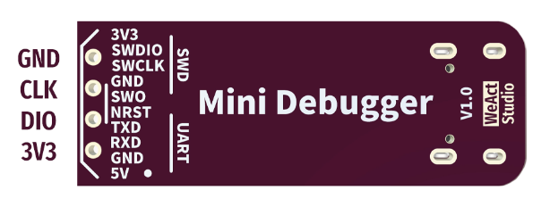

# WeAct Mini Debugger (ST-Link V2.1) – Debugger / Programmer

## Overview

The **WeAct Mini Debugger ST-Link V2.1** is a compact and modern debugger/programmer for STM32 microcontrollers.

It extends the functionality of the classic ST-Link V2 by adding:

- Integrated USB-to-UART converter
- SWO (Serial Wire Output) support
- Improved USB interface (V2.1)

In this course it is used to:
- Flash STM32 boards (Black Pill)
- Perform SWD debugging
- Capture debug output via SWO
- Use UART without additional adapters

---

## Image

---

## Key Specifications

- Interface: USB to SWD + UART
- Protocols: SWD, SWO, UART
- Target voltage: **3.3V**
- Built-in USB-to-UART bridge
- Able to supply power to the target (current limited by USB)
- Compatible with STM32 MCUs
- Supported by STM32CubeIDE, OpenOCD, PlatformIO
- Compact form factor

⚠ Designed for **3.3V systems**.

---

## Important Electrical Limits

- Target voltage: **3.3V**
- All signals are **3.3V logic**
- Limited current available from onboard regulator

Always ensure:
- Common ground between debugger and target
- Correct voltage level before connecting

---

## Commonly Used Connections

### SWD (Debugging)

| WeAct Pin | STM32 (Black Pill) | Function |
|----------|--------------------|----------|
| SWDIO    | PA13               | Data |
| SWCLK    | PA14               | Clock |
| GND      | GND                | Ground |
| 3.3V     | 3.3V               | Reference |

Optional:
- NRST → RESET

---

### UART (Serial Communication)

| WeAct Pin | STM32 | Function |
|----------|--------|----------|
| TX       | PA10   | RX (MCU) |
| RX       | PA9    | TX (MCU) |
| GND      | GND    | Ground |

---

## Pinout

---

## Important Features

- **SWD debugging** (standard STM32 workflow)
- **SWO support** for real-time debug output
- **USB-to-UART** integrated (no extra adapter needed)
- Single device for programming + logging

---

## Power Considerations

- Can provide **3.3V output** (limited current)
- Recommended to power target board separately

⚠ Do not power motors or high-current devices.

---

## Typical Workflow

1. Connect device via USB
2. Connect SWD (and optionally UART)
3. Flash firmware
4. Start debug session
5. Monitor UART logs or SWO output

---

## Common Student Mistakes

- Mixing UART TX/RX lines
- Not sharing GND
- Using wrong COM port (UART vs debugger)
- Forgetting to enable SWO in firmware
- Overwriting SWD pins

---

## Comparison with ST-Link V2

| Feature | ST-Link V2 | WeAct ST-Link V2.1 |
|--------|------------|--------------------|
| SWD Debugging | Yes | Yes |
| SWO Support | No / limited | Yes |
| USB-to-UART | No | Yes |
| USB Interface | Older | Improved |
| Number of devices needed | 2 (SWD and UART) | 1 for both SWD and UART |

---

## Benefits over ST-Link V2

- **All-in-one tool** (debug + UART)
- Fewer cables and adapters
- Cleaner lab setup for students
- Enables **SWO debugging** (advanced tracing)
- Better suited for modern workflows

---

## Typical Use in This Course

- Flashing STM32 firmware
- Debugging with breakpoints
- UART logging without extra hardware
- Optional SWO-based debugging
- Faster setup for lab exercises

---

## Documentation

- https://github.com/WeActStudio/WeActStudio.MiniDebugger
- https://openocd.org/

---

## Summary

The WeAct Mini Debugger (ST-Link V2.1) is a modern, compact, and versatile tool that combines:

- Debugging
- Programming
- Serial communication
